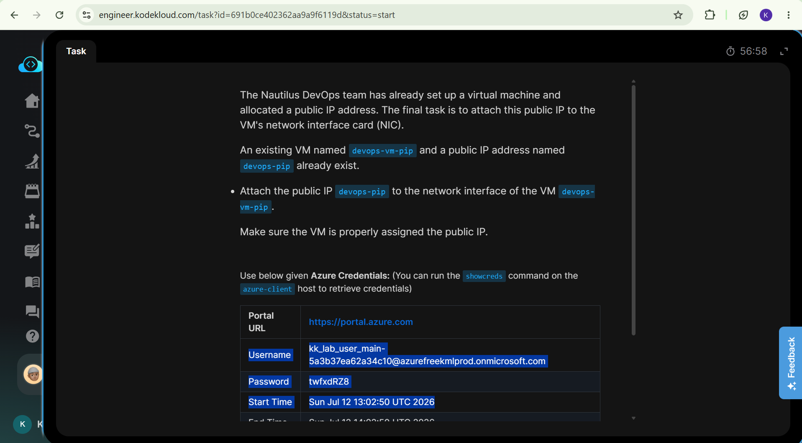

# Day 10: Project Overview

Today I was tasked with attaching a Network Interface Card disk to an existing Virtual Machine

## Key Learnings
* **Public IP Configuration:** Completed the hands-on challenge to attach a Public IP address to an existing Azure Virtual Machine.
* **Network Connectivity:** Gained practical experience managing Network Interface Card (NIC) IP configurations to enable internet access to cloud resources.
* **VM State Troubleshooting:** Learned the importance of ensuring the Virtual Machine is in a 'running' state and properly configured to validate the IP attachment successfully.
## Screenshots
### 1. Task Instructions and Scenario
Here is the initial project prompt outlining the requirements for attaching an existing Network Interface Card to an existing Virtual Machine.

### 2. Toggle to Virtual Machines
This is where we toggle to the Virtual Machines to see find the xfusion-vm.

### 3. Stop the VM
In order to attach NIC we have to ensure that that we deallocate our Virtual Machine as attaching a new one would change the machines virtual hardware configuration, just like on a physical computer we have to reboot it after installing new hardware.

### 4. Find Virtual Machine network settings
This is where we find the network settings and click on "Attach network interface"

### 5. Find and attach NIC
A dropdown should appear with all the existing network interfaces, we click on "xfusion-nic".

### 6. Network Interface attached
Confirmation that the NIC is attached to the virtual machine.

### 6. Restart Virtual Machine
Then we make sure we restart the virtual machine to ensure that it boots with the new hardware configured.

### 6. Notifications to show everything is done
Solution

