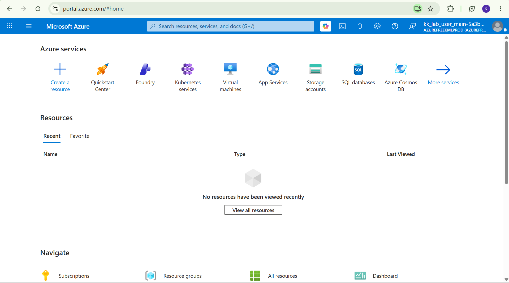
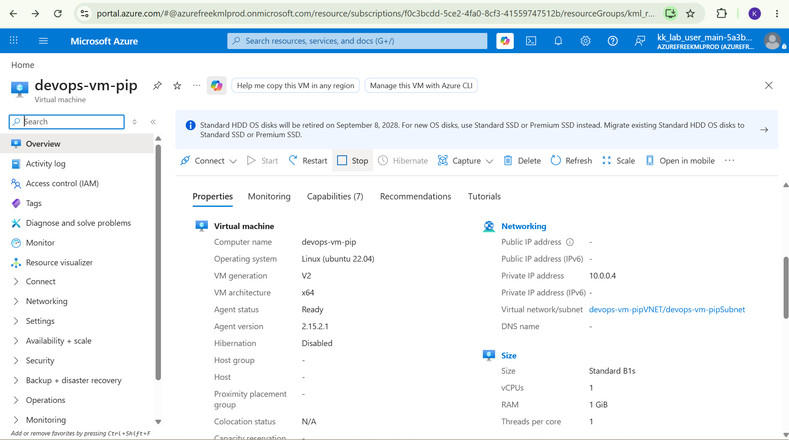
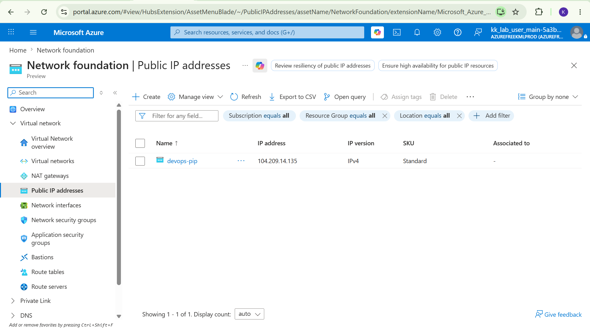
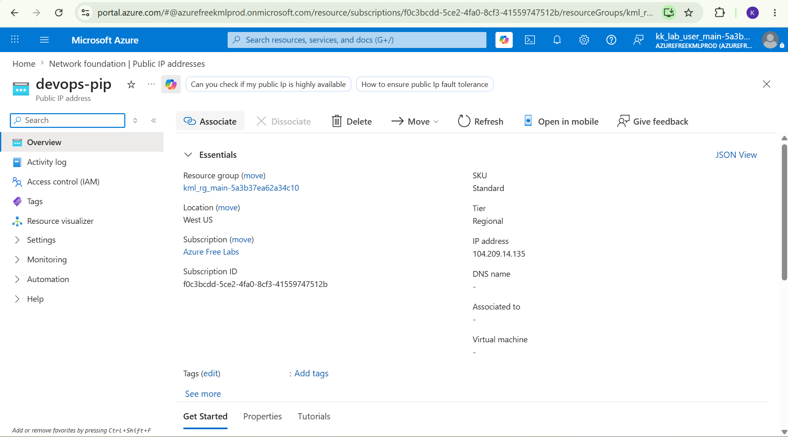
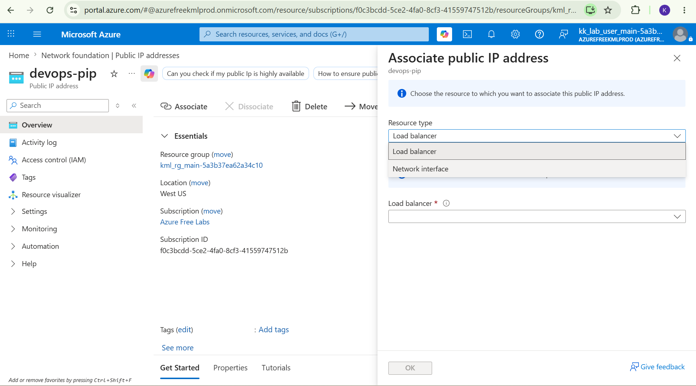

# Day 10: Project Overview

Today I was tasked with attaching an existing public IP named "devops-pip" to an existing Virtual machine's network interface.

## Key Learnings
* Public IP Configuration: Completed the hands-on challenge to attach a Public IP address to an existing Azure Virtual Machine.
* Network Connectivity: Gained practical experience managing Network Interface Card (NIC) IP configurations to enable internet access to cloud resources.
* VM State Troubleshooting: Learned the importance of ensuring the Virtual Machine is in a 'running' state and properly configured to validate the IP attachment successfully.
## Screenshots
### 1. Task Instructions and Scenario
Here is the initial project prompt outlining the requirements for attaching an existing Network Interface Card to an existing Virtual Machine.

### 2. Log into the Azure portal
This is where we log into the Azure portal.

### 2. Search for Virtual Machines
This is where we search and find the existing vm called "devops-vm-pip".

### 3. Stop VM from running 
In order to attach NIC we have to ensure that that we deallocate our Virtual Machine as attaching a new one would change the machines virtual hardware configuration, just like on a physical computer we have to reboot it after installing new hardware.

### 4. Find IP address
This is where we find the IP named "devops-pip".

### 5. Find Associate
Once you have clicked into the IP Address you will find "Associate", click on it, this is where you will attach your IP to your VM.

### 6. Change Resource type
This is where we change the resource type from load balancer to network interface as we want to attach it to the VM.

### 7. Find your Network Interface
After changing resource type then you will be able to click on a drop down and every existing VM appears, click on your desired one and click "Apply".

### 8. Restart VM
After this we restart the vm to make sure it reboots with the new hardware.

