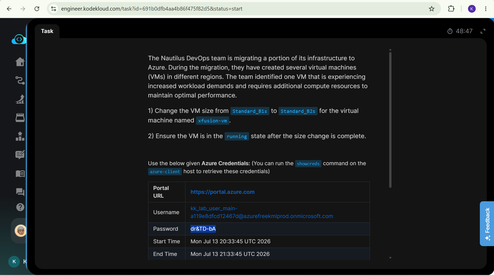
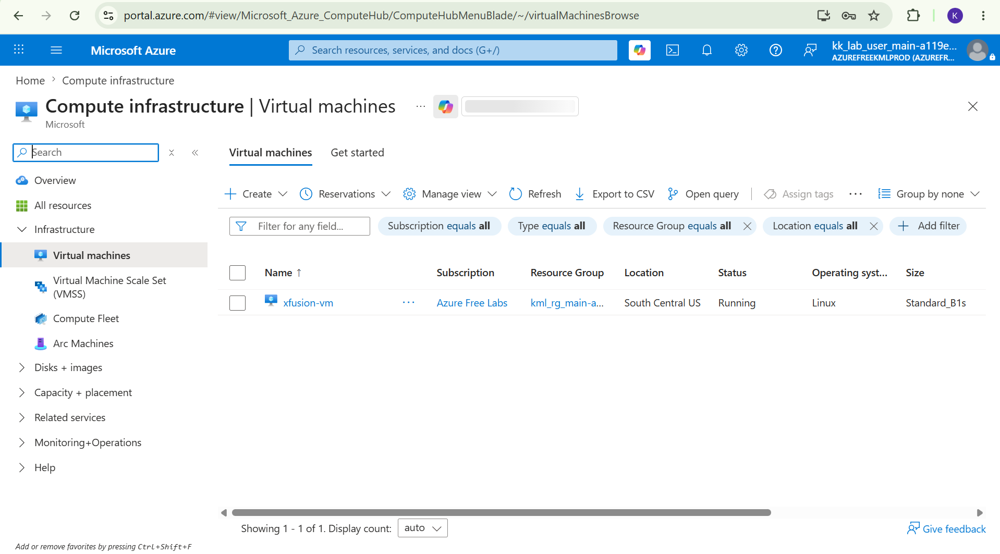
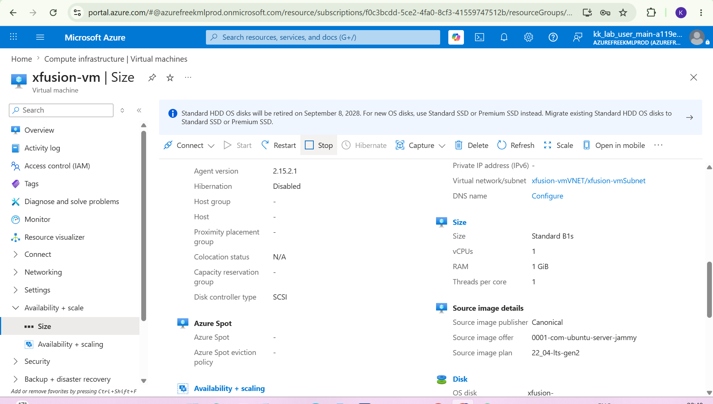
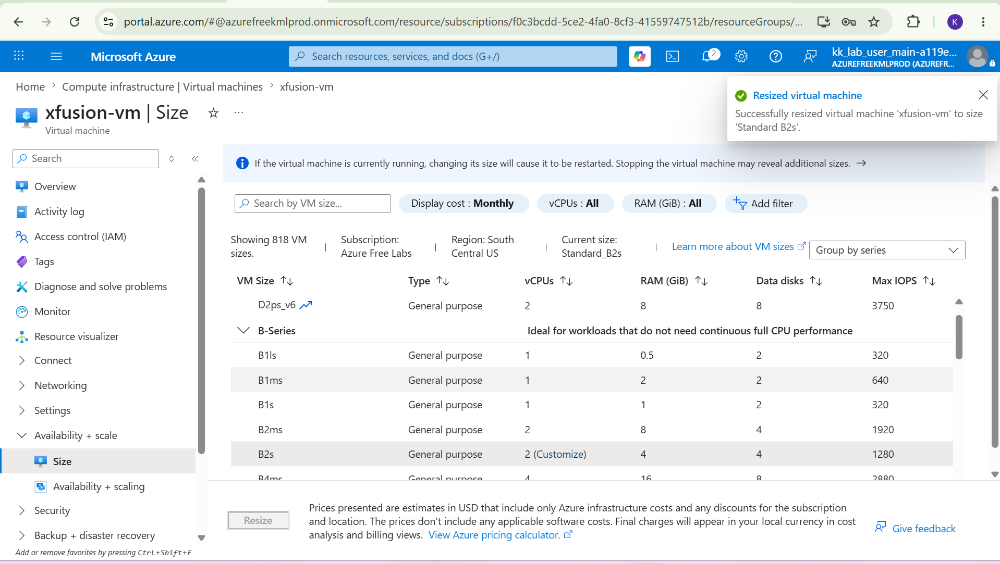
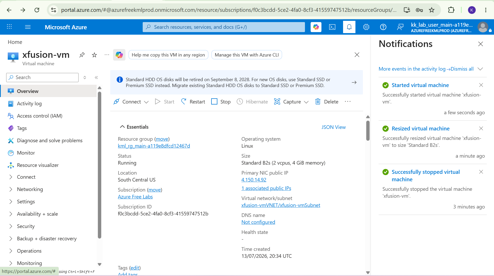

# Day 11: Project Overview

Today I was tasked with changing a Virtual machines size from a Standard_B1s to a Standard_B2s to maintain optimal performance on the machine since it was recently migrated.

## Key Learnings
*  VM Resizing: Learned how to change a VM from Standard_B1s to Standard_B2s to provide additional compute resources.
*  Scaling for Workload Demands: The VM was resized because its workload increased and it needed more CPU/RAM capacity to maintain performance.
*  Managing VM State: Learned to ensure the VM is running after the resize, so the workload can resume normally.

## Screenshots
### 1. Task Instructions and Scenario
Here is the initial project prompt outlining the requirements for changing the Virtual Machine size.

### 2. Toggle to Virtual Machines
This is where we toggle to the Virtual Machines to see whether the xfusion-vm exists and here it is below.

### 3. Stop(deallocate) Virtual Machine
This is where we stop the virtual machine from running since we'll be making a change to the hardware the click on size.

### 4. Change Size
If you look it currently says the "Current size" is Standard_B1s, we want to change it to B2s, scroll down and click on B2s

### 5. Restart Virtual machine
The size has been changed as you can see from the notifications and the Virtual machine has been restarted.

