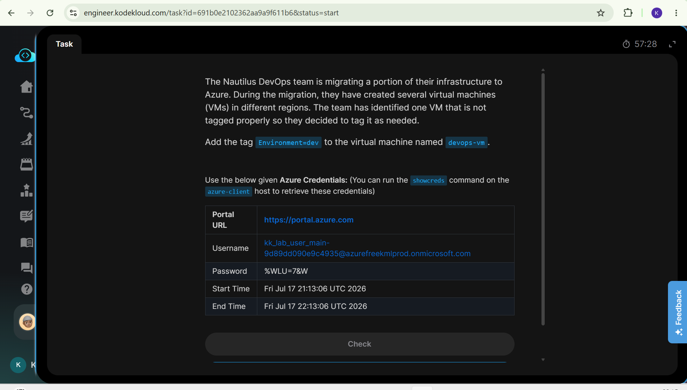
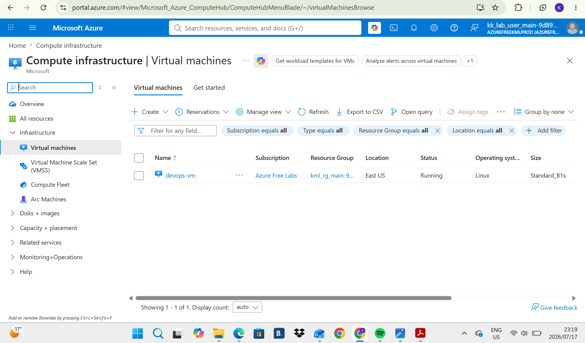
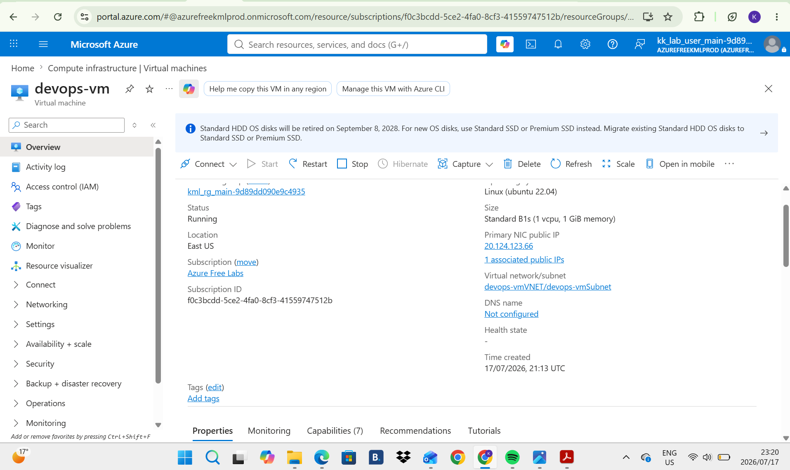
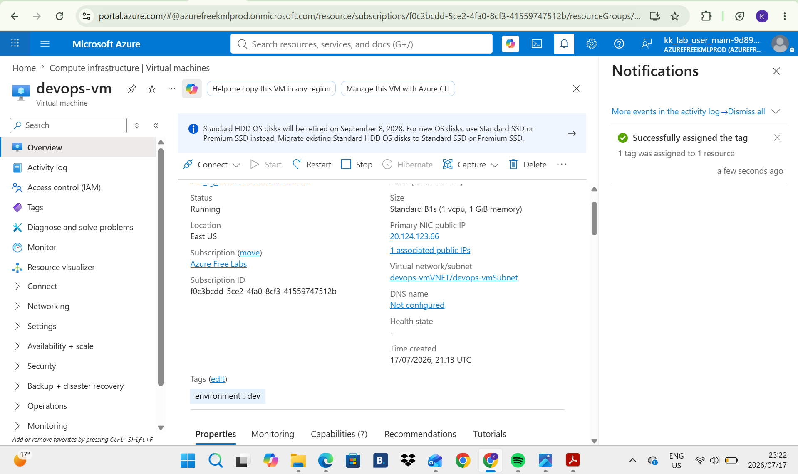

# Day 12: Project Overview

Today I was tasked with adding a tag to a Virtual Machine .

## Key Learnings
* Azure Resource Tagging: Learned how to add tags to Azure resources, such as Environment=dev, to organize and identify them.
* Resource Organization: Tags help distinguish resources based on their environment, purpose, project or department, especially when managing many resources.
* Resource Management & Cost Tracking: Proper tagging makes it easier to manage, filter, monitor and track costs across Azure resources.

## Screenshots
### 1. Task Instructions and Scenario
Here is the initial project prompt outlining the requirements for changing the Virtual Machine size.

### 2. Toggle to Virtual Machines
This is where we toggle to the Virtual Machines to see whether the devops-vm exists and here it is below.

### 3. Look for Tags
After clicking on the VM we look for "Tags", as we can see there is no tag assigned as of yet.

### 3. Tag changed
After clicking on it we find the different environments in the company then we assign it to "dev", as you can see now the tag environment is assigned to "dev".

