## Day 13: SSH into an Azure Virtual Machine
## Project Overview
Today I was tasked with adding an SSH public key on a Virtual Machine for secure access. This would ensure password-less SSH access to the Virtual Machine.

### Key Learnings
* **SSH Key Management:** Generating and securely storing public and private SSH keys for authentication instead of relying on passwords.
* **VM Configuration:** Configuring the Azure Virtual Machine network settings to accept secure SSH connections over port 22.
* **Remote Administration:** Establishing an encrypted tunnel from the terminal to the VM, allowing for secure command-line management and file operations. 

### Screenshots
### 1. Task Instructions and Scenario
Here is the initial project prompt outlining the requirements for adding an SSH public key to the VM.
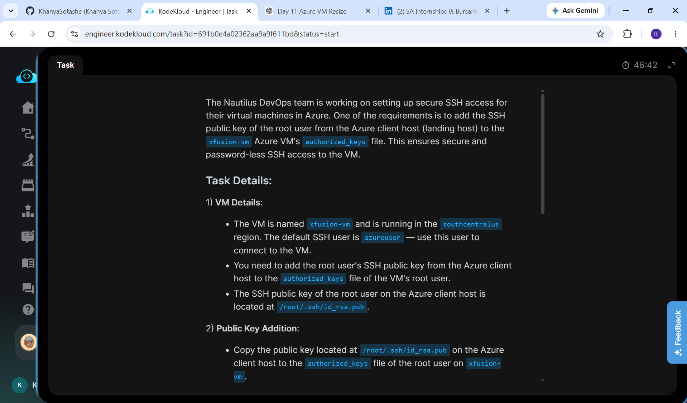

### 2. Check current directory
This is where I check which directory I am in and in this case its the root directory
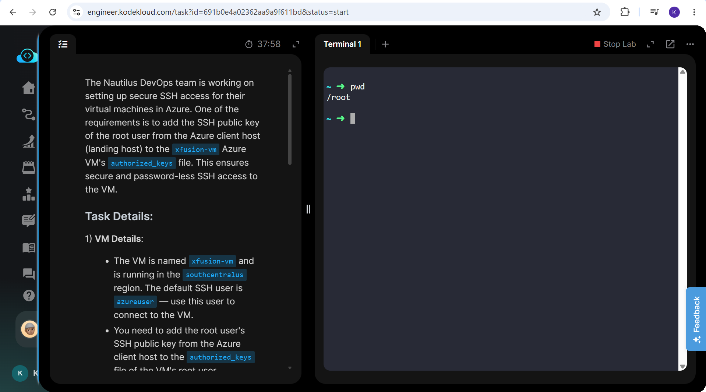
### 3. Change to SSH Directory
With this command we change into the SSH directory which is normally situated in your home directory, this folder typically contains files related to remote connections such as your private and public SSH keys.
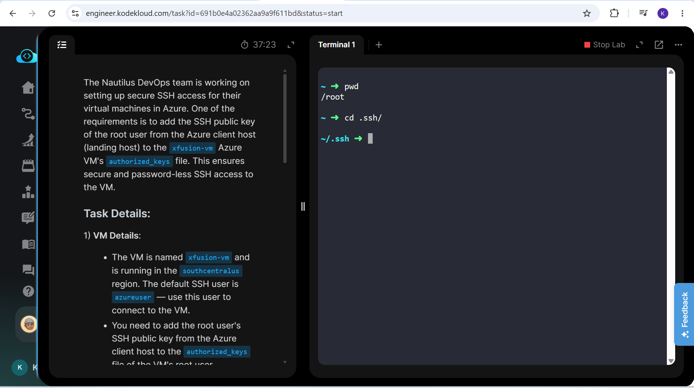
### 4. List key
The "ls" command is to list the public keys available.
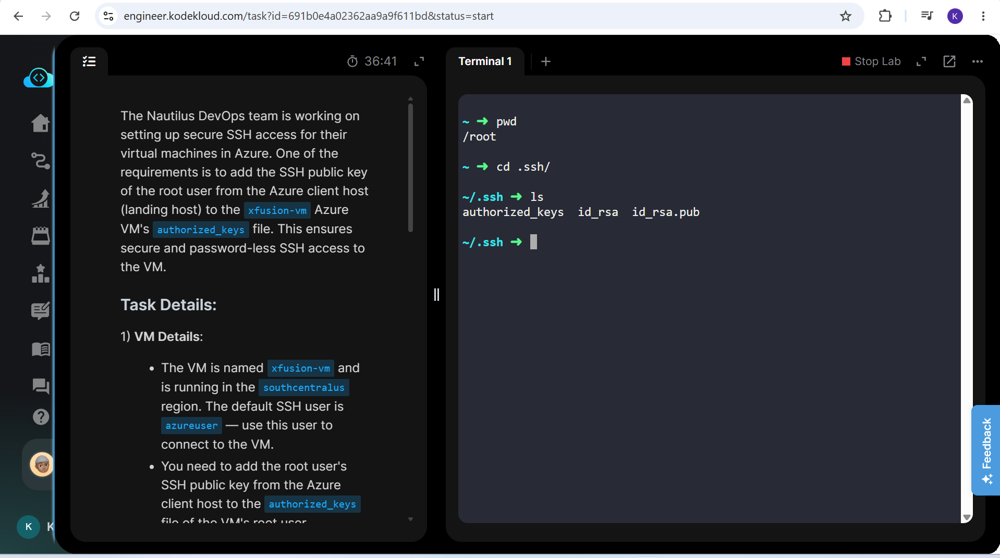
### 5. Read and copy public key
We then use the "cat" command to read and copy the public key contents, we save this information as it will be needed later.
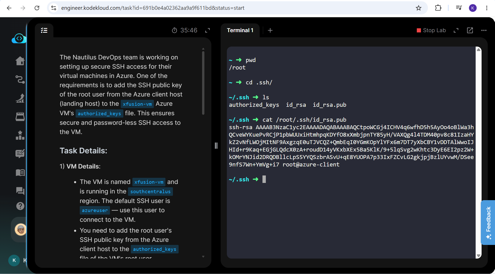
### 6. Log into Azure portal
We log into the Azure portal and this is the landing page.
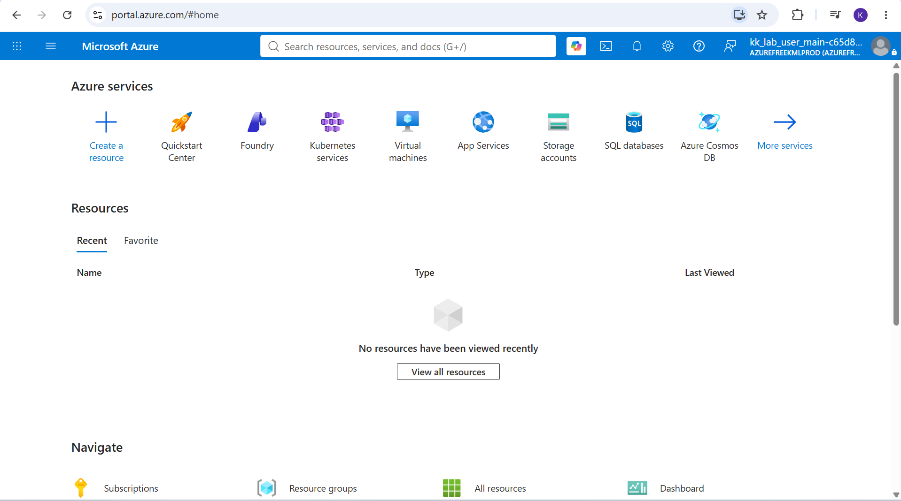
### 7. Find Virtual Machines IP Address
We then toggle to the virtual machines to find xfusion-vm, we click on it and then find the IP address which is "20.225.43.252" in this case.
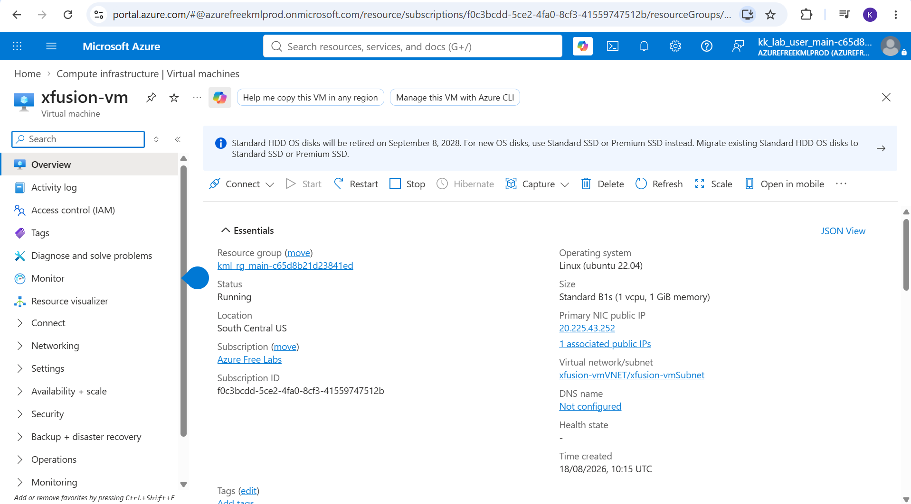
### 8. Connect to virtual machine remotely
The "ssh azureuser@<20.225.43.252" command is to create a secure, encrypted terminal session to connect to the VM remotely.
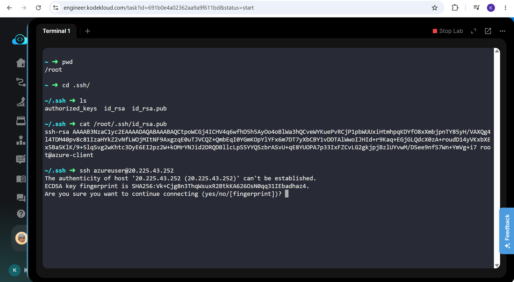
### 9. Confirmation that you've connected to VM
You will have noticed that the terminal has changed from ssh to azure@xfusion-vm meaning I have remotely connected to the VM.
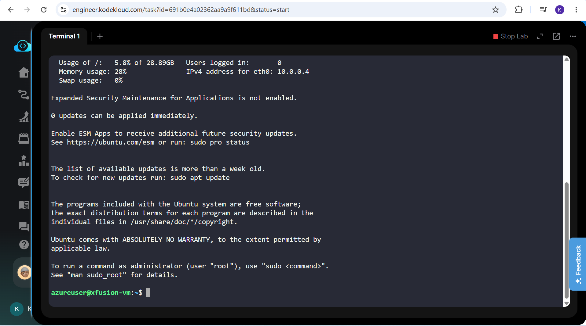
### 10. Elevate privilege to root
We then use the "sudo" command to get full administrative rights, this is needed to make changes.
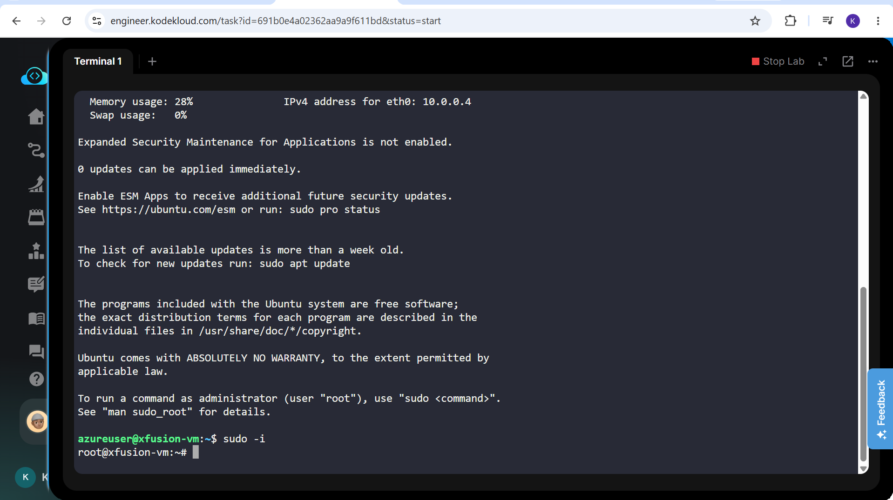
### 11. Create SSH directory
Here we basically create a folder to store the keys and permissions to authenticate connection.
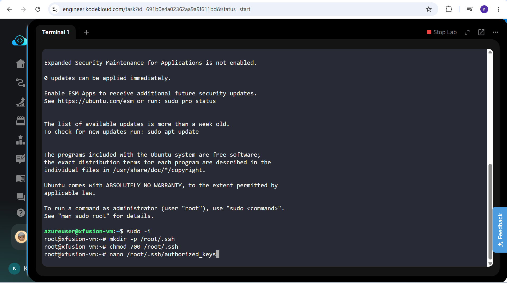
### 12. Open text editor to edit folder
We open the "authorized_keys" file and delete any data in it, we then copy and paste the information we copied earlier for the id_rsa.pub, this means the server will trust my computer and be able to access it without asking for a password.
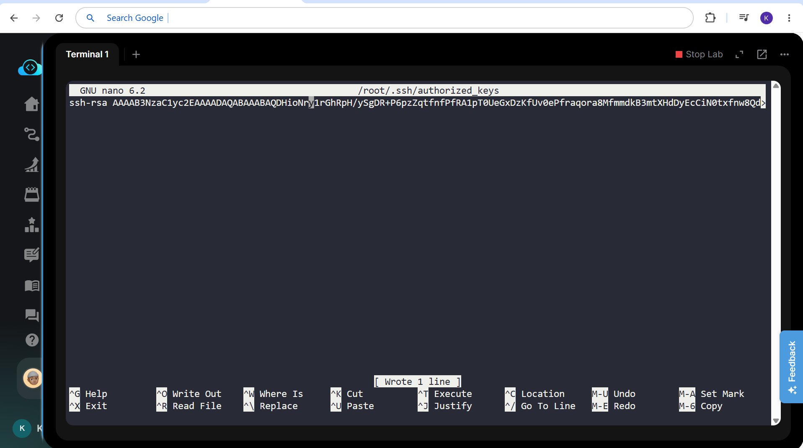
### 13. Set permissions
The "chmod 600" command is to ensure that only the root user can read or write too the authorized key file.
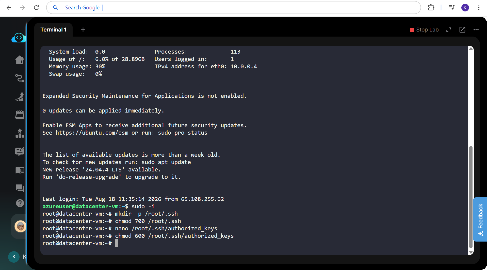
### 14. Check connection
We then try to connect to the VM after exiting it to check whether it asks for a password and in this case it doesnt.
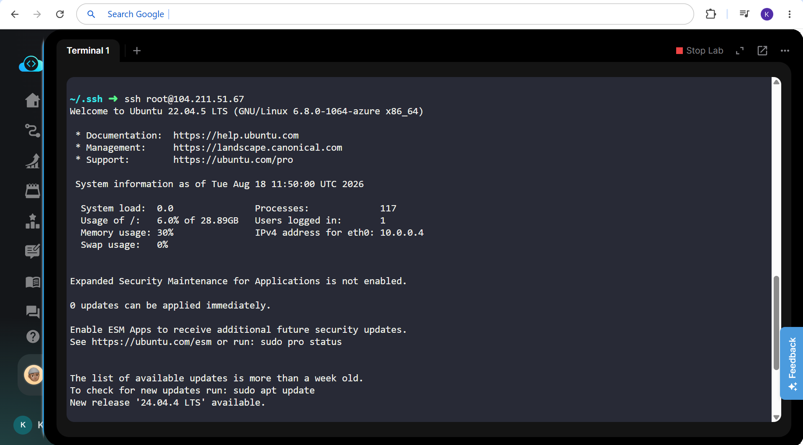

