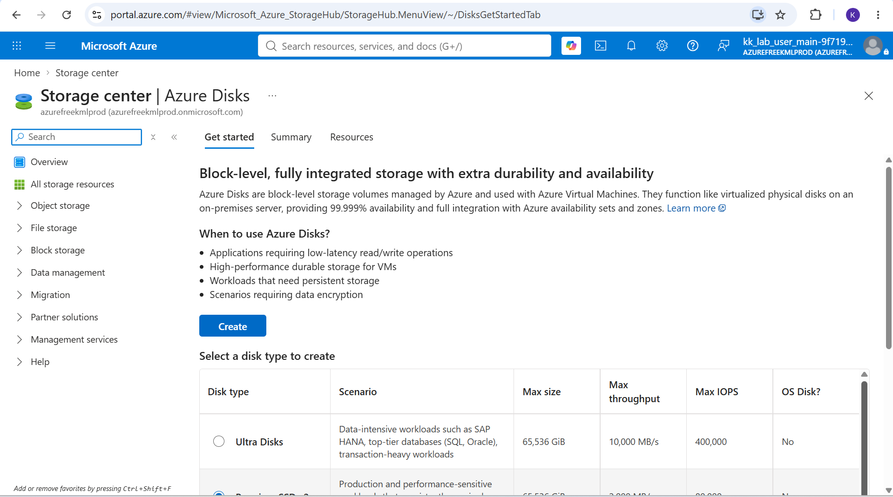
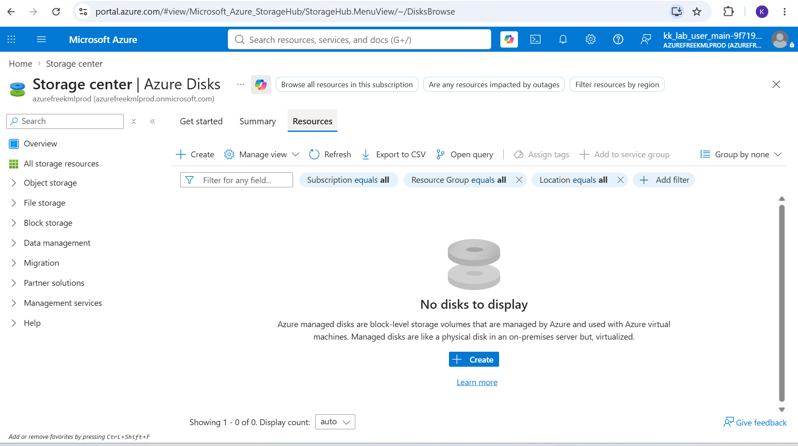
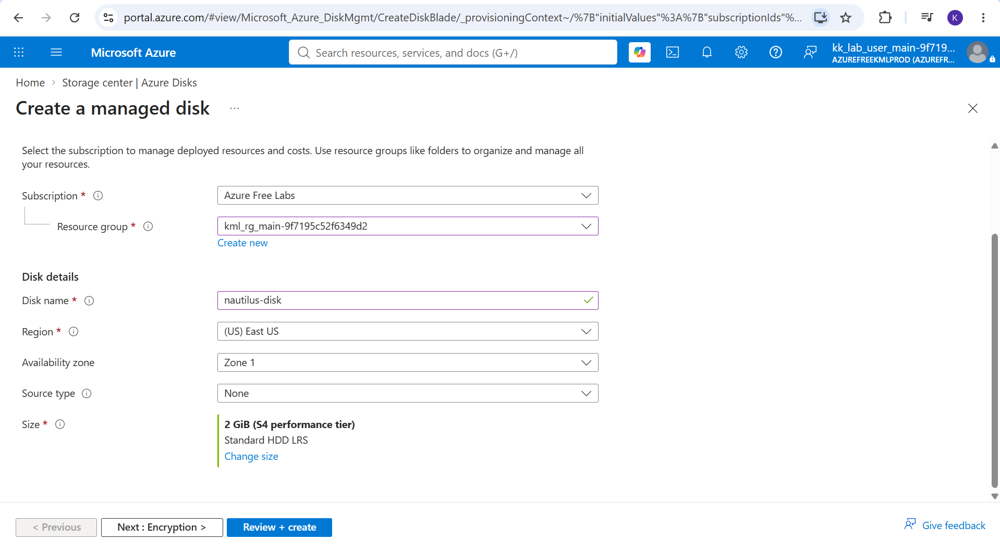
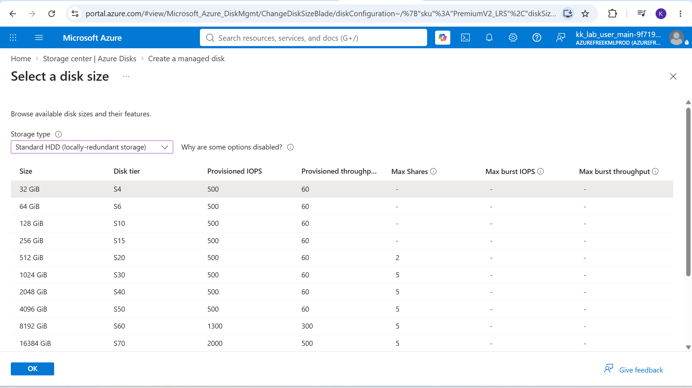
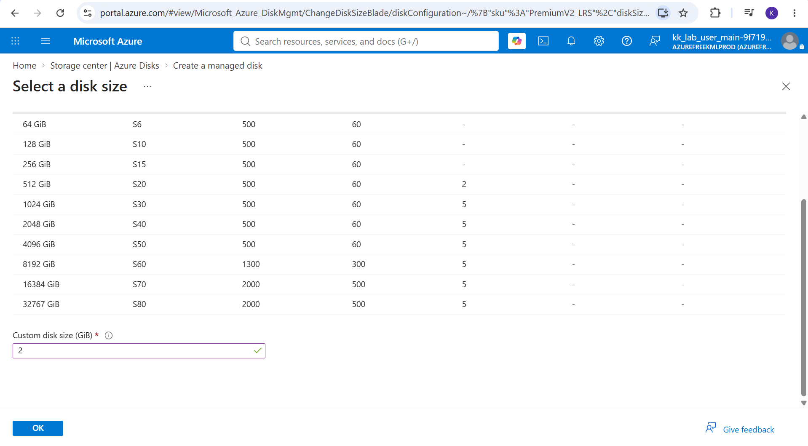
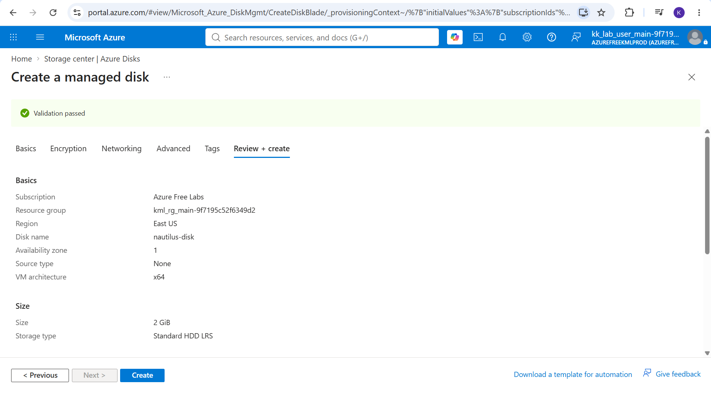
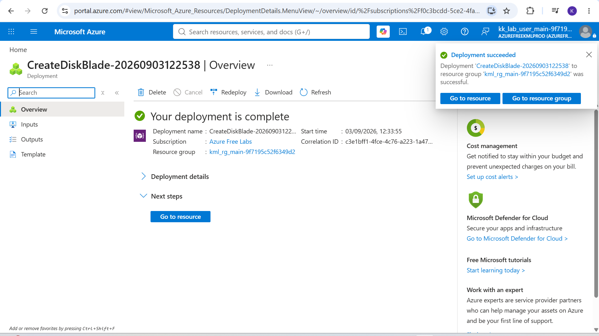

# Day 14: Project Overview

Today I was tasked with provisioning a standalone Azure Managed Disk. This exercise focused on configuring block-level storage resources..

## Key Learnings
**Storage Management:** Successfully created an Azure Managed Disk, learning how to provision storage capacity dynamically based on project requirements.
**Block-Level Storage:** Deepened my understanding of how Azure handles block storage behind the scenes, ensuring high availability and durability.
**Disk Configurations:** Explored different performance tiers (like Standard HDD, Standard SSD, and Premium SSD) and redundancy options (like LRS or ZRS) that dictate how data is replicated and accessed.

## Why Standalone Disks Matter

While data disks are eventually attached to compute resources, provisioning them independently first is a common cloud practice. 

### Here is why it is useful:

1. **Independent Lifecycles:** Creating a disk separately ensures the data persists even if an associated VM is later deleted or re-provisioned. 
2. **Migration and Backup:** Standalone disks can be created from snapshots or backups, making it easier to migrate data across regions or restore systems in a disaster recovery scenario.
3. **Infrastructure as Code (IaC):** In automated environments, storage and compute are often provisioned as separate modules before being linked together later in the deployment pipeline.

## Screenshots

### 1. Task Instructions and Scenario
Here is the initial project prompt outlining the requirements for creating the managed data disk.

### 2. Navigate to Disks
Searching for and selecting the "Disks" service from the Azure Portal global search bar.

### 3. Create a New Disk
Clicking "Create" to begin configuring the new managed disk settings.

### 4. Configure Basics
Setting up the essential details, including the subscription, resource group, disk name, and region.

### 5. Select Disk Size and Performance
Choosing the appropriate disk tier and size (in GiB) based on the required IOPS and throughput for the scenario.

### 6. Review and Create
Passing final validation and clicking "Create" to initialize the deployment.

### 7. Deployment Successful
Verification that the Azure Managed Disk has been successfully provisioned and is ready for use.

