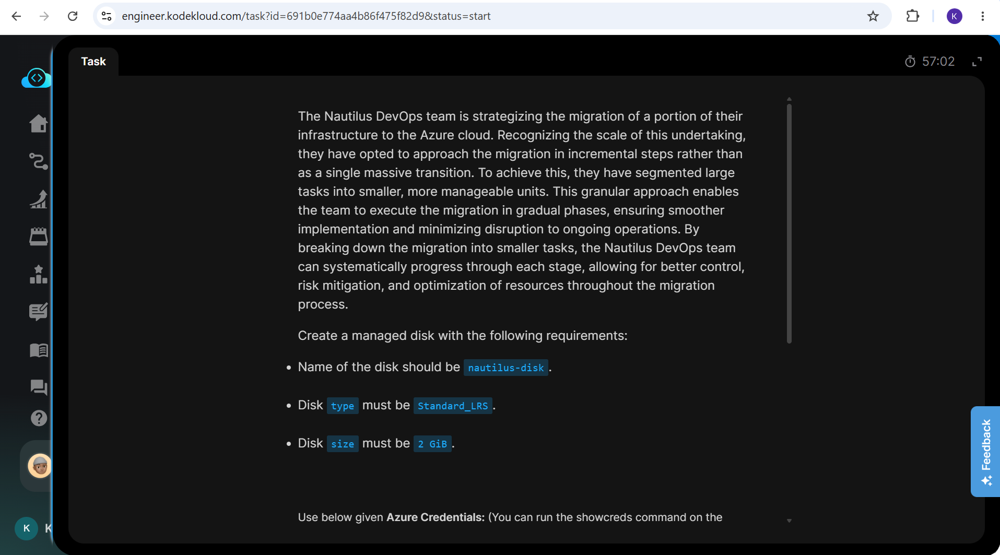

# Day 14: Project Overview

Today, I was tasked with creating and attaching a new managed data disk to an existing Azure Virtual Machine. This exercise focused on expanding VM storage capabilities dynamically without disrupting the operating system drive.

## Key Learnings

**Storage Management:** Successfully provisioned and attached an Azure Managed Disk dynamically. This simulates real-world scenarios where application storage requirements scale post-deployment.
**Block-Level Storage:** Deepened my understanding of Managed Disks as highly available, block-level storage resources managed natively by the Microsoft Azure infrastructure.
**Data Disk vs. OS Disk:** Practically applied cloud best practices by separating the host operating system from application data, ensuring the data disk persists independently of the VM's lifecycle.

## Why Wait for VM Initialization?

When modifying infrastructure such as attaching a new disk, it is critical to ensure the virtual machine has completed initialization and is in a stable state (either "Running" or "Stopped (Deallocated)") rather than "Creating" or "Updating".

### Here is why this is important:

1. **Azure Resource Locks:** While a VM is provisioning, the Azure Resource Manager (ARM) places a lock on it to prevent conflicting changes. Attempting to attach a disk during this phase will usually result in a failed deployment error.
2. **Guest OS Hardware Detection:** The virtual machine's guest operating system needs to be completely booted to load its storage drivers. If you attach a disk before the OS is ready to listen for hardware changes, the disk may not mount correctly, preventing you from initializing and formatting it.
3. **Automated Validation Scripts:** For lab environments like KodeKloud, automated grading scripts query the VM's state through the Azure API. If the VM is still reporting as "Updating," the validation check might skip the disk verification entirely and mark the task as incomplete.

## Screenshots

### 1. Task Instructions and Scenario
Here is the initial project prompt outlining the requirements for attaching the data disk to the VM.

### 2. Toggle to Virtual Machines
Toggling to the Virtual Machines blade to confirm the `devops-vm` is provisioned and running.

### 3. Virtual Machine Overview
Navigating to the Virtual Machine overview and scrolling down to locate the "Disks" setting under the storage configuration.

### 4. Attach New Disk
Accessing the disk management pane and clicking "Create and attach a new disk" to begin provisioning.

### 5. Click on Existing Disk to Attach
Locating the pre-configured "Devops-Disk", selecting it, and applying the changes to attach it to the VM.

### 6. Successful
Verification that the data disk has been successfully attached and is ready for initialization within the guest OS.

