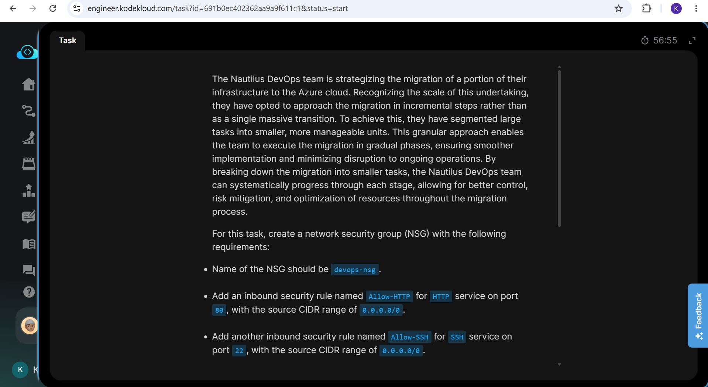
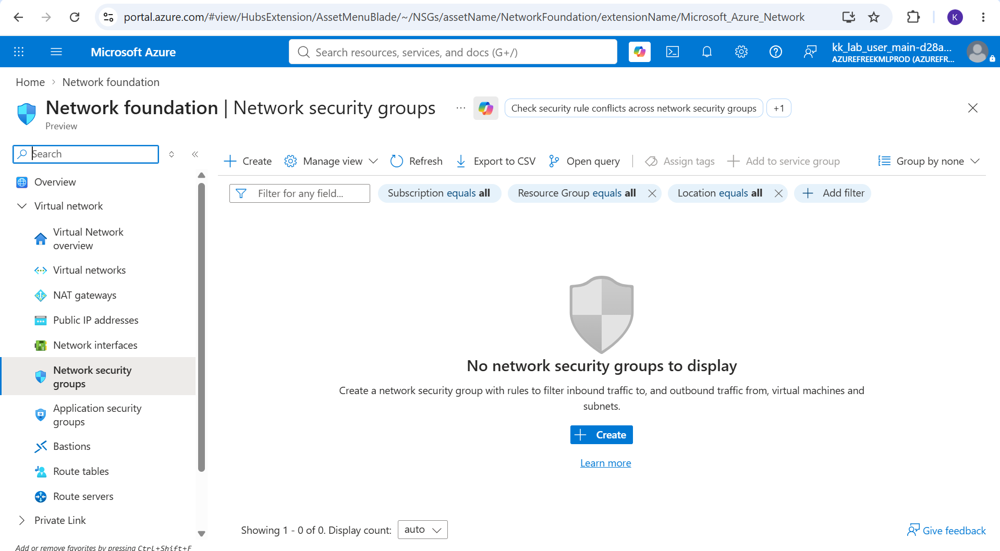
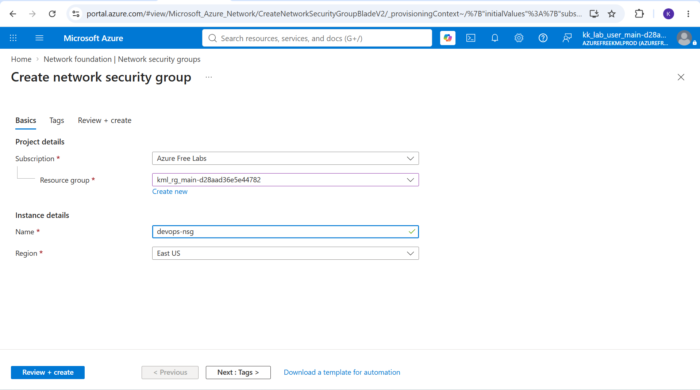
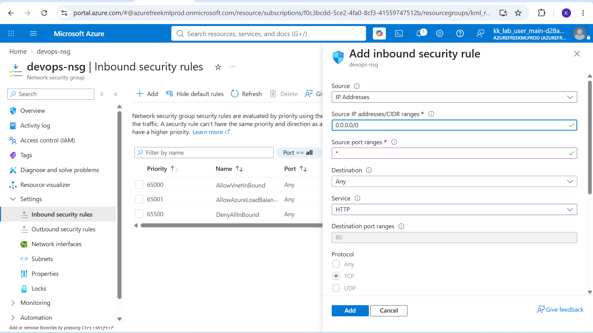
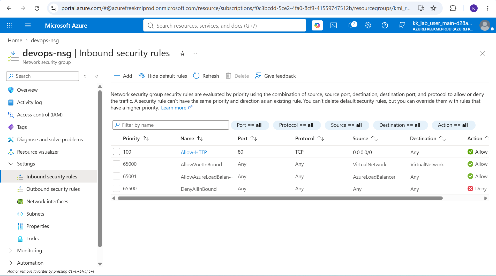
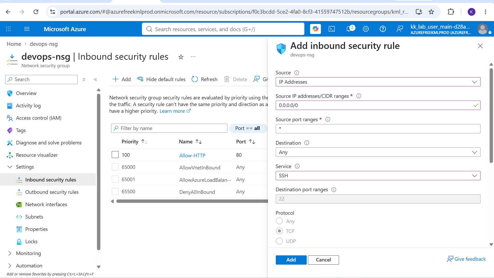
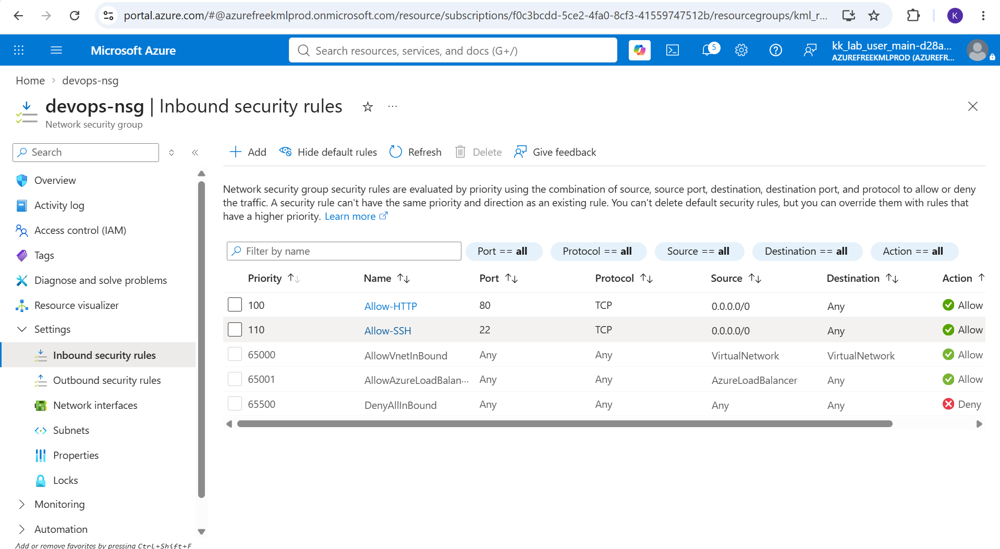

# Day 15: Project Overview

Today I was tasked with creating and configuring a Network Security Group (NSG) in Azure. This exercise focused on securing and filtering network traffic to and from Azure resources.

## Key Learnings

**Traffic Filtering:** Successfully created an NSG, learning how to explicitly allow or deny network traffic using inbound and outbound security rules.
**Rule Evaluation:** Deepened my understanding of how Azure evaluates security rules based on priority numbers, protocols, source IPs and destination ports.
  **Default Security Rules:** Explored the baseline default security rules that Azure provisions with every NSG and how they impact default connectivity within a Virtual Network.

## Why Network Security Groups Matter

While provisioning compute and network resources is essential, controlling the traffic that flows between them is a fundamental pillar of cloud security. NSGs act as a virtual firewall for your Azure infrastructure.

### Here is why it is useful:

1. **Granular Access Control:** NSGs allow you to define exactly what type of traffic is permitted to reach specific resources, drastically minimizing the attack surface (e.g., restricting RDP or SSH access to known IP ranges).
2. **Flexible Attachment:** NSGs can be associated with individual network interfaces (NICs) for VM-specific rules or attached to entire subnets to apply a blanket security policy across multiple resources simultaneously.
3. **Application Security Groups (ASGs):** NSGs integrate closely with ASGs to simplify complex rule management, allowing you to group VMs by their workload (like "Web Servers" or "Databases") rather than managing sprawling lists of individual IP addresses.

## Screenshots

### 1. Task Instructions and Scenario
Here is the initial project prompt outlining the requirements for creating and configuring the network security group.

### 2. Navigate to Network Security Groups
Search for and select the "Network security groups" service from the Azure Portal global search bar.

### 3.Create and Configure Basics
Setting up the essential details, including the subscription, resource group, NSG name, and region.

### 5. Add HTTP
Configuring a custom inbound rule to allow HTTP traffic and assigning it a priority number.

### 5. Add SSH
Configuring a custom inbound rule to allow SSH traffic and assigning it a priority number.

