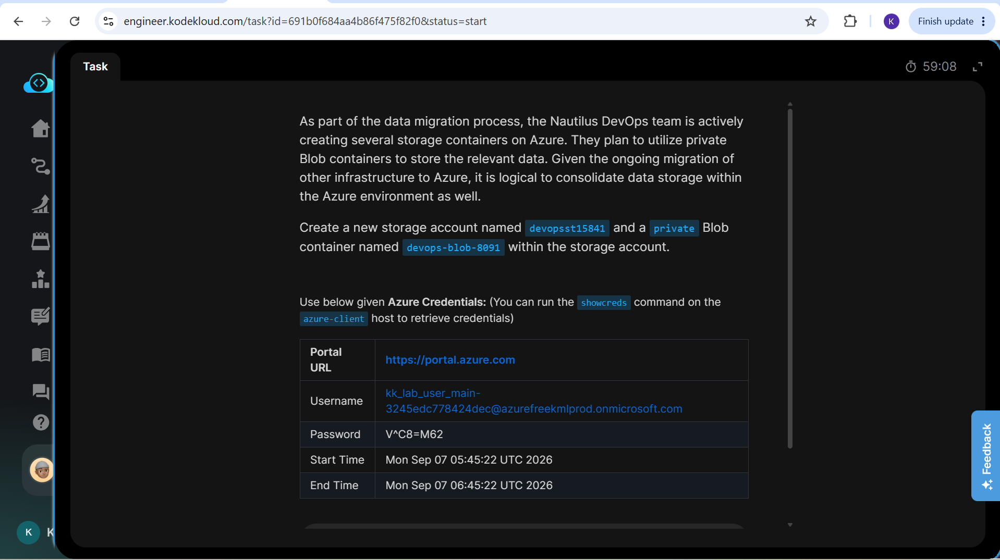
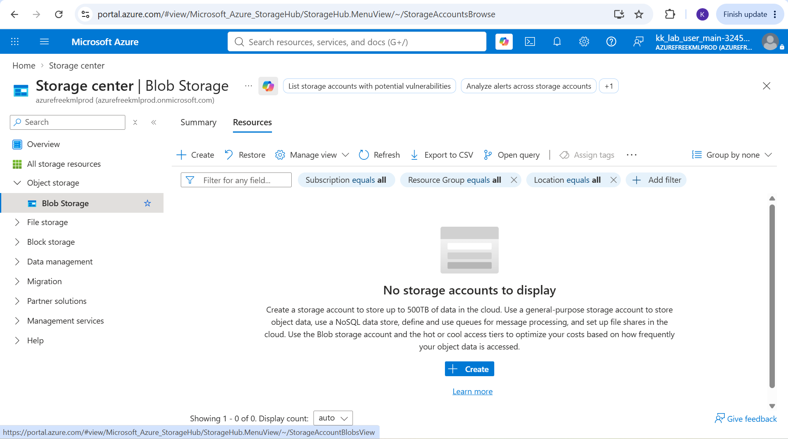
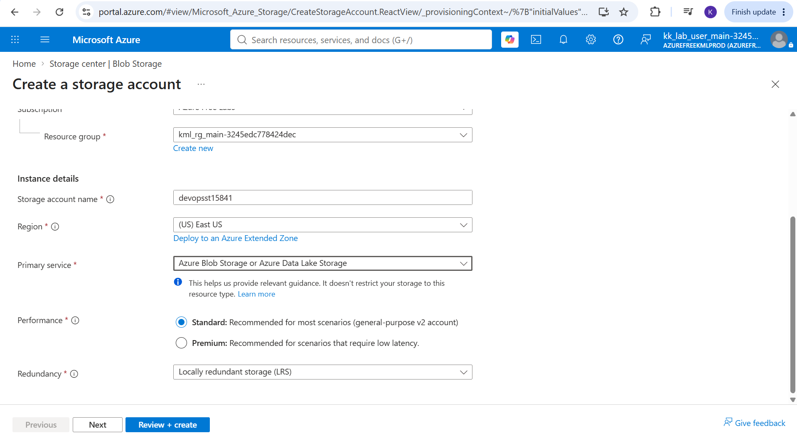
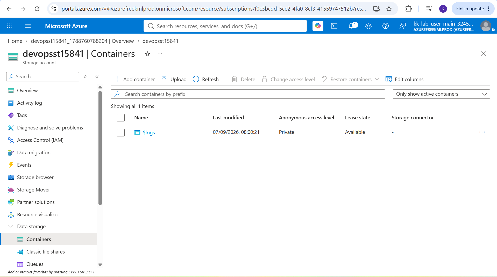
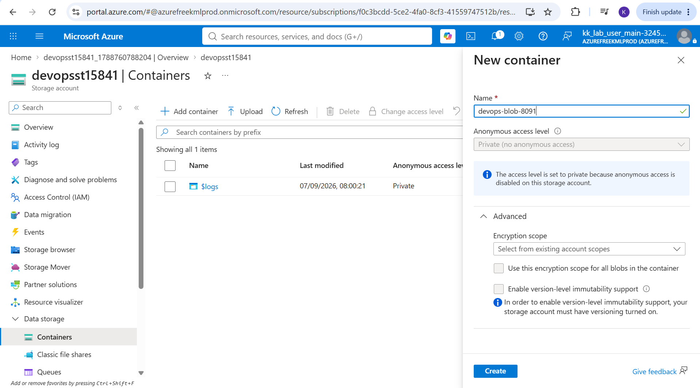
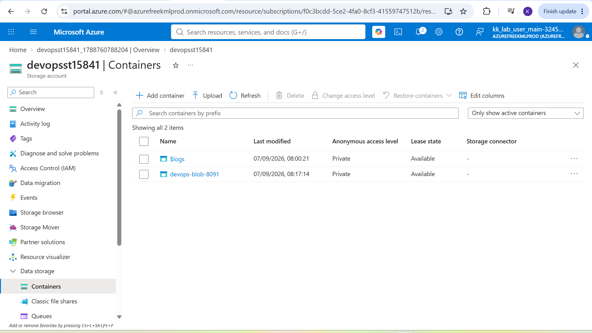

# Day 16: Project Overview

Today I was tasked with creating a private Azure Blob Storage container. This exercise focused on provisioning and configuring secure, scalable object storage for unstructured data within Azure.

## Key Learnings

* **Storage Account Provisioning:** Successfully created an Azure Storage Account which serves as the top-level administrative namespace for blob data.
* **Container Configuration:** Provisioned a blob container and explicitly configured its public access level to "Private" to enforce data security.
* **Access Control Foundations:** Deepened my understanding of how Azure isolates data from the public internet, requiring explicit authorization (like SAS tokens or Entra ID) to access stored blobs.

## Why Private Blob Storage Matters

While public containers are useful for hosting open assets like website images, most enterprise data requires strict access control. Private Blob Storage is the default and most secure way to handle sensitive unstructured data in the cloud.

### Here is why it is useful:

1. **Data Security & Compliance:** Setting the container to private ensures that sensitive files, application logs or database backups cannot be read or downloaded by unauthorized users on the internet.
2. **Granular Authorization:** Even though it is private from the web, you can still grant temporary, tightly scoped access to specific users or applications using Shared Access Signatures (SAS) or Azure role-based access control (RBAC).
3. **Cost-Effective Scalability:** It provides a highly durable, massively scalable repository for unstructured data (documents, media, backups) without compromising on enterprise-grade security.

## Screenshots

### 1. Task Instructions and Scenario
Here is the initial project prompt outlining the requirements for creating the private blob storage container.

### 2. Navigate to Storage Accounts
Searching for and selecting the "Storage accounts" service from the Azure Portal global search bar.

### 3. Create a Storage Account
Configuring the fundamental settings for the storage account, including the resource group, globally unique storage account name and region.

### 4. Create a Container
Navigating to the "Containers" blade within the newly deployed storage account and clicking "+ Container" to add a new one.

### 5. Configure Private Access Level
Naming the container and ensuring the "Public access level" is strictly set to **Private (no anonymous access)**.

### 6. Deployment Successful
Verification that the storage container has been successfully provisioned and is securely locked down from public access.

