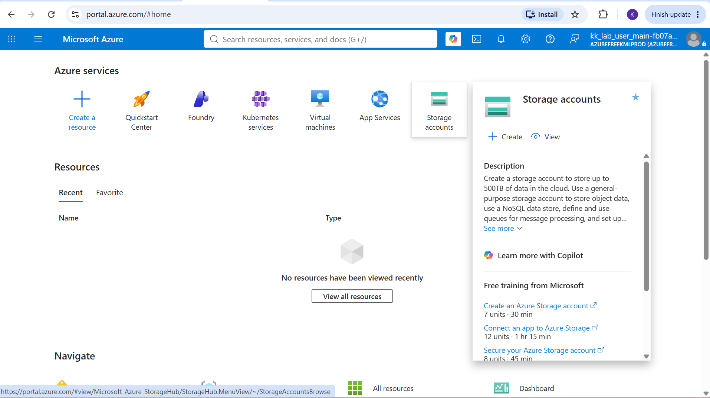
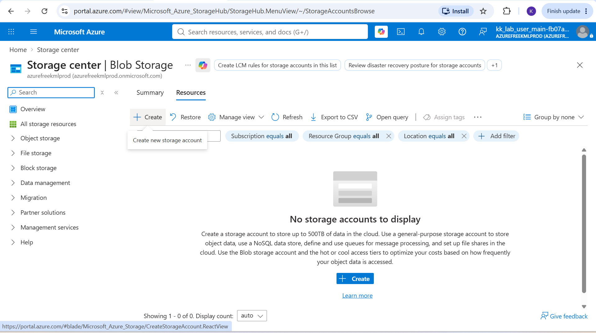
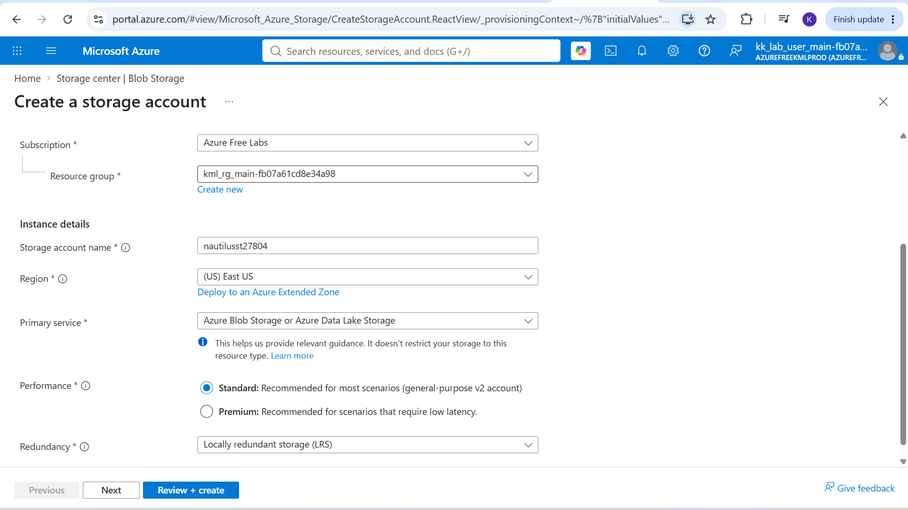
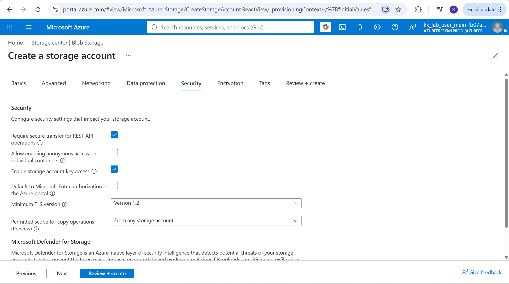
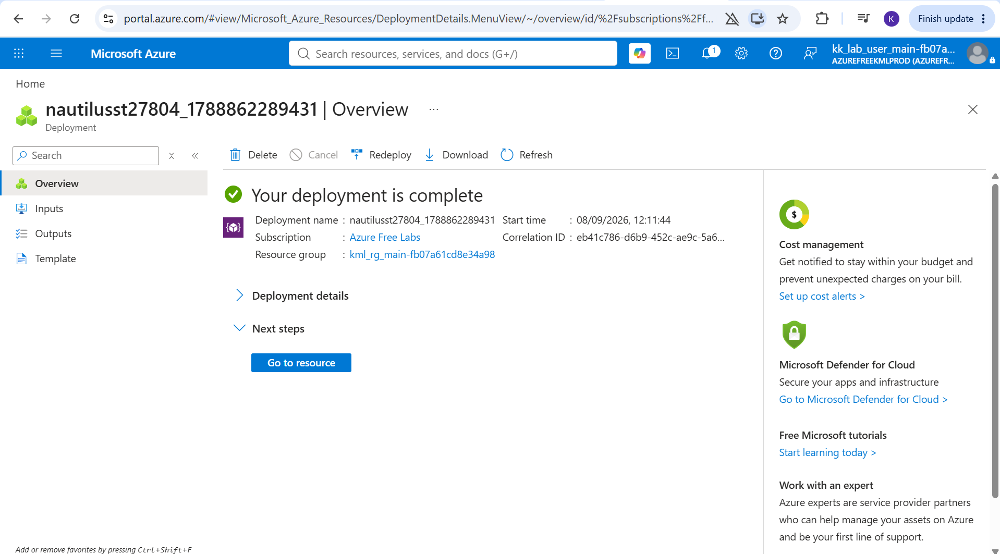
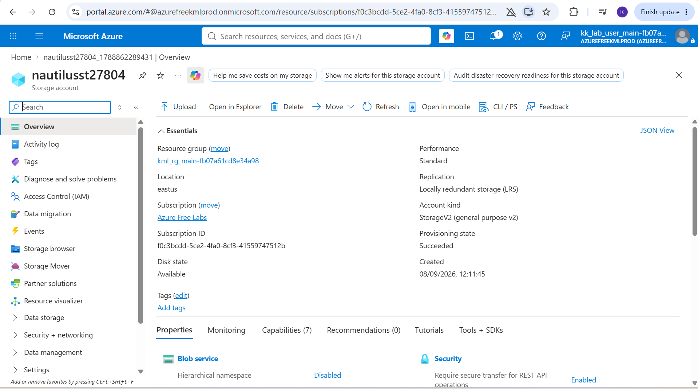
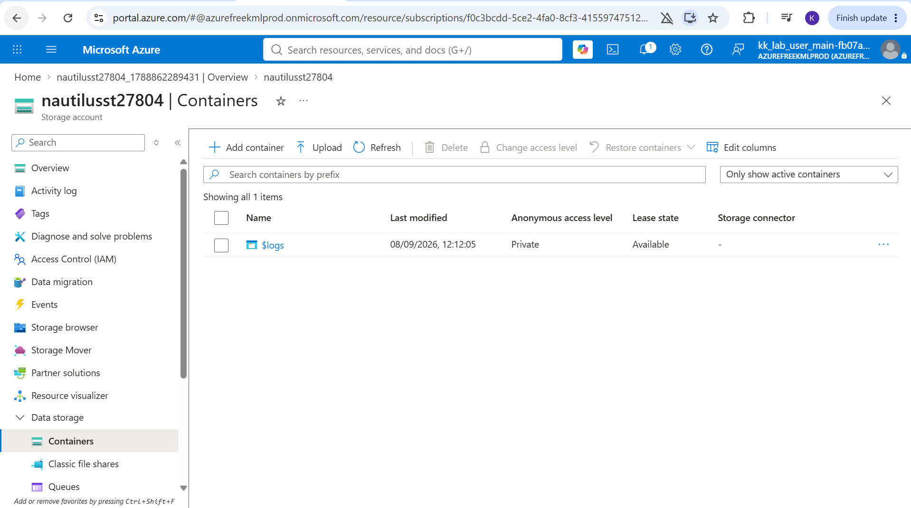
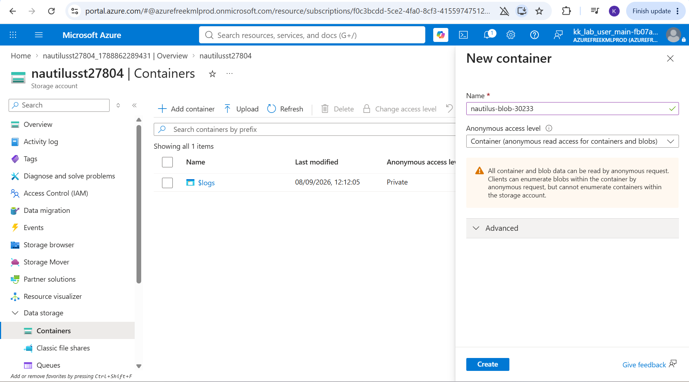
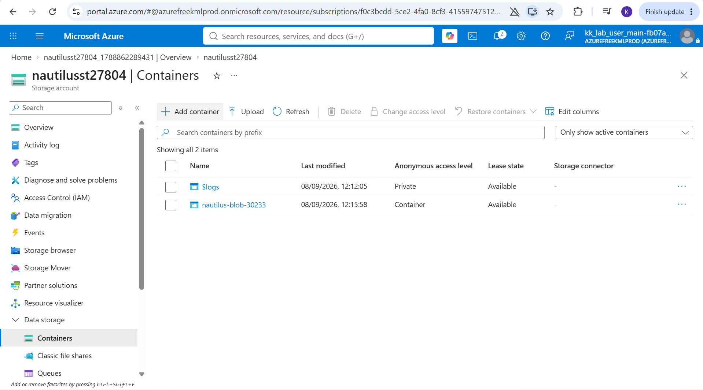

# Day 17: Project Overview

Today I was tasked with creating an Azure Storage Account and provisioning a public Blob Storage container. This exercise focused on configuring storage designed to serve unstructured data such as images or documents directly to the internet with anonymous access, taking account of every configuration event in the deployment pipeline.

## Key Learnings

* **Storage Account Provisioning:** Successfully deployed an Azure Storage Account, navigating through the Basics, Advanced and Networking configuration tabs to tailor the resource.
* **Public Container Configuration:** Created a blob container and intentionally configured its public access level to allow anonymous read access for blobs, enabling direct internet access.
* **Access Level Validation:** Deepened my understanding of how Azure routes public requests by uploading a test file and successfully accessing it via its public URI without authentication.

## Why Public Blob Storage Matters

While private containers are essential for sensitive data, public blob storage plays a crucial role in modern web architecture by offloading static asset delivery from compute resources.

### Here is why it is useful:

1. **Hosting Static Assets:** Public containers are ideal for hosting static web assets like images, CSS and JavaScript files for front-end applications.
2. **Cost-Effective Media Distribution:** It provides an incredibly cheap and highly scalable way to distribute public documents or media files to users globally.
3. **Seamless CDN Integration:** Public blob containers can easily be integrated with Azure Content Delivery Network (CDN) to cache assets at edge nodes worldwide.

## Step-by-Step Execution

### 1. Task Instructions and Scenario
Reviewing the initial project prompt outlining the requirements for creating the storage account and public blob container.

### 2. Navigate to Storage Accounts
Searching for and selecting the "Storage accounts" service from the Azure Portal global search bar.

### 3. Initialize Creation
Clicking the "+ Create" button to open the deployment wizard for a new Storage Account.

### 4. Configure Basics
Setting up the fundamental details: selecting the Subscription, creating/selecting a Resource Group, inputting a globally unique Storage account name, and choosing the Region, Performance (Standard), and Redundancy (LRS/GRS) options.

### 5. Advanced Configuration (Enable Public Access)
Navigating to the "Security" tab to ensure that the "Allow enabling anonymous access on individual containers" setting is enabled at the storage account level. This prerequisite must be toggled on before individual containers can be made public.

### 6. Review and Deploy
Passing the final automated validation checks and clicking "Create" to initialize the ARM template deployment. 

### 7. Go to Resource
Once the deployment succeeds, clicking "Go to resource" to access the newly created Storage Account management plane.

### 8. Navigate to Containers
Scrolling down the left-hand menu to the "Data storage" section and selecting "Containers", then clicking "+ Container".

### 9. Configure Container Access Level
Naming the new container and explicitly expanding the advanced access level dropdown to select **Blob (anonymous read access for containers and blobs)**.

### 10. Confirmation that the Container was created
The container has been created and its not private.

