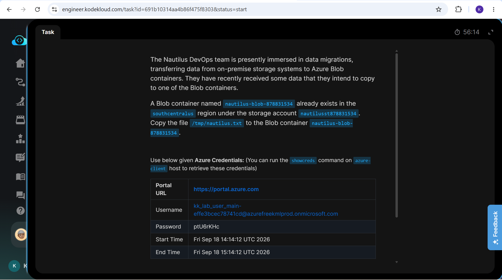
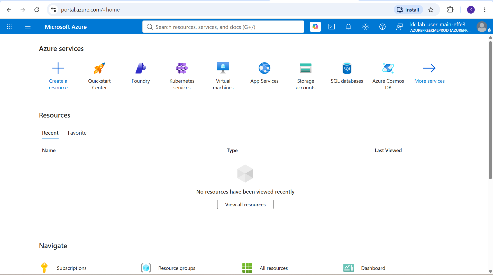
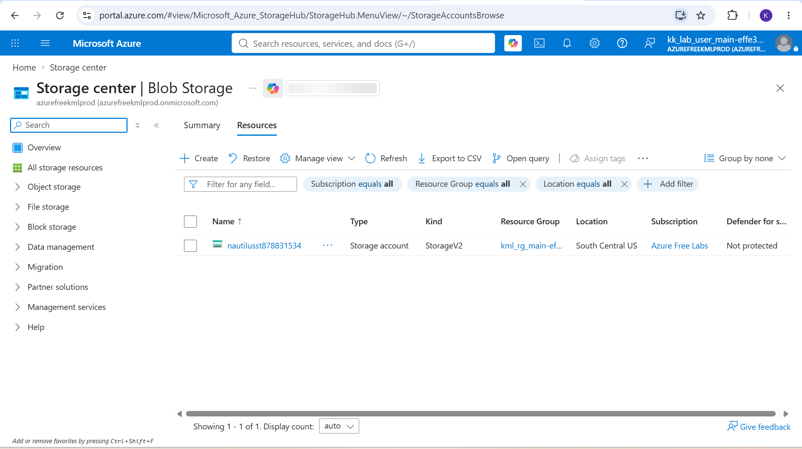
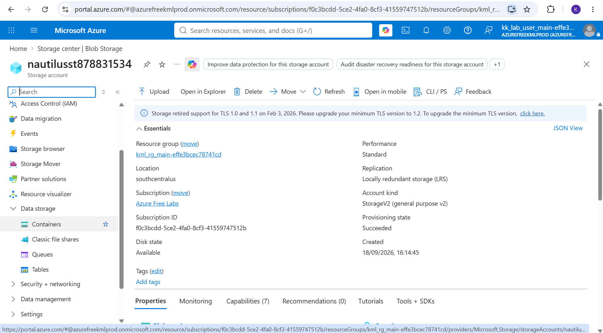
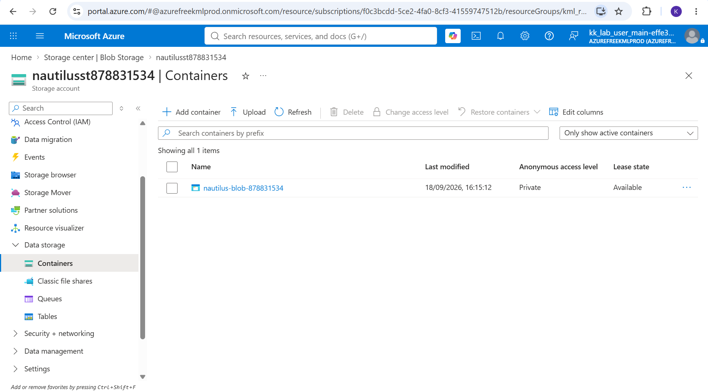
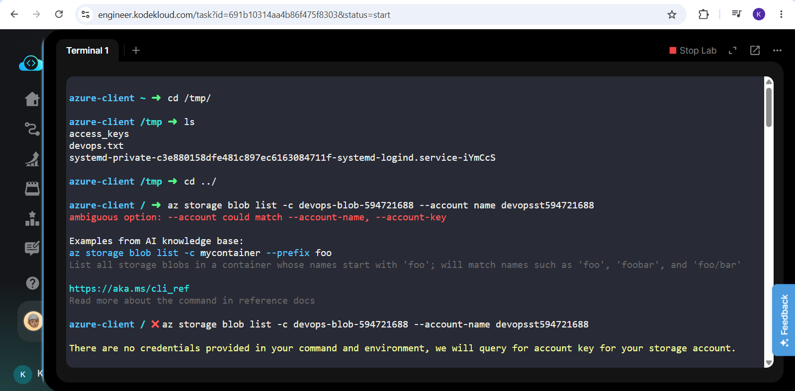
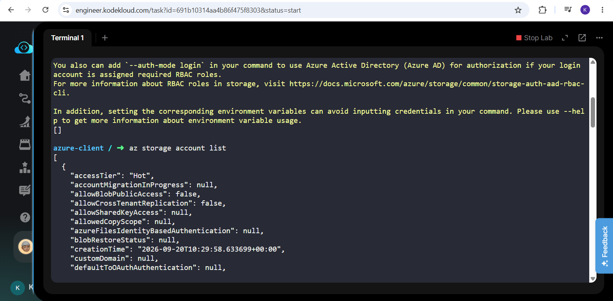
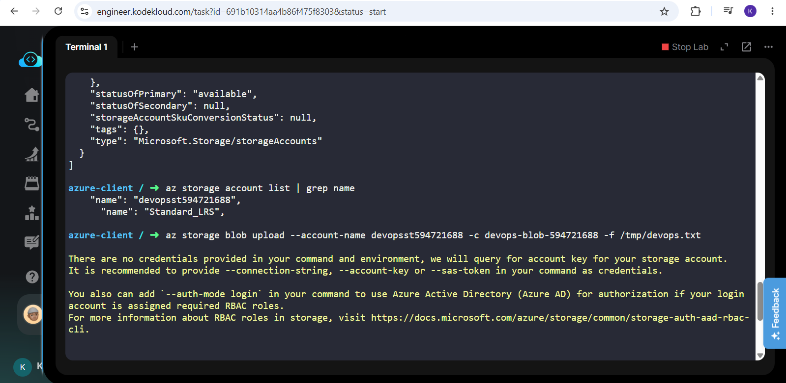
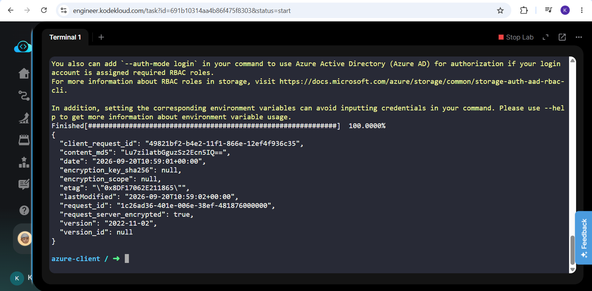
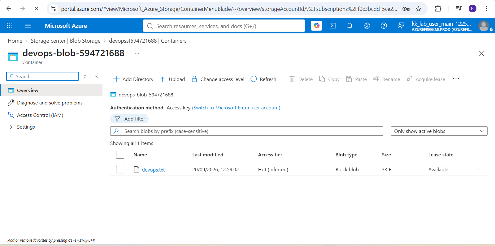

# Day 18: Project Overview

Today I was tasked with assisting the Nautilus DevOps team in a data migration scenario, specifically transferring data from an on-premise storage system to an Azure Blob container. The exercise focused on interacting with pre-existing Azure Storage resources and securely copying a local file to a specific container using the command line. 

NOTE :**I restarted my lab, you'll notice my screenshots contain "Nautilus" rather than "Devops" for my container and storage account**

## Key Learnings
* **Data Migration:** Successfully transferred a local file "/tmp/devops.txt" to a cloud-based Azure Blob container.
* **Resource Identification:** Navigated and interacted with a specific pre-provisioned storage account "devopsst594721688" and container "devops-blob-594721688" located in the "southcentralus" region.
* **Command-Line Operations:** Utilized an Azure client environment and the "showcreds" command to authenticate and execute data transfer commands effectively.

## Why Cloud Data Migration Matters
Moving on-premise data to cloud storage is a fundamental aspect of modernizing IT infrastructure and adopting hybrid cloud strategies.

### Here is why it is useful:
1. **Centralized Data Management:** Consolidating on-premise files into Azure Blob Storage allows for unified management, backup and security policies.
2. **Scalability:** Cloud storage easily scales to accommodate massive amounts of unstructured data without the need to procure physical hardware.
3. **Accessibility:** Once migrated, data can be securely accessed globally by other cloud services, applications or remote teams.

## Step-by-Step Execution

### 1. Task Instructions and Scenario
Reviewing the initial project prompt outlining the requirements for creating uploading a file to an Azure blob storage.

### 2. Authenticate to Azure Portal
Navigated to "https://portal.azure.com" and logged in using the retrieved credentials.

### 3. Locate the Target Storage Account
Searched for "Storage accounts" in the Azure Portal global search bar and selected the pre-provisioned account named "nautilusst878831534", confirming it was located in the "southcentralus" region.

### 4. Verify the Target Blob Container
Scrolled to the "Data storage" section on the left-hand menu, selected "Containers" and verified the existence of the destination container named "nautilus-blob-878831534".

### 5. Execute the Data Transfer
Using the "azure-client" terminal, I utilized Azure CLI to upload the local on-premise file to the cloud. Authenticated the CLI and executed the upload command targeting the file at "/tmp/devops.txt" to place it directly into the "devops-blob-594721688" container.

### 6. Validate the Migration
Returned to the Azure Portal, opened the "devops-blob-594721688" container and verified that "devops.txt" was successfully listed inside, confirming the data migration was complete.

