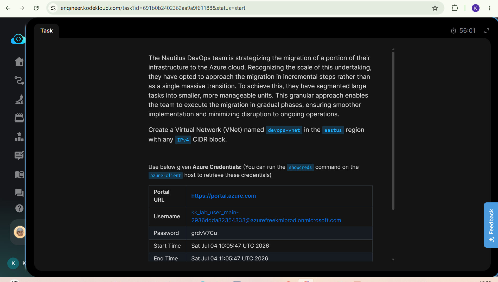
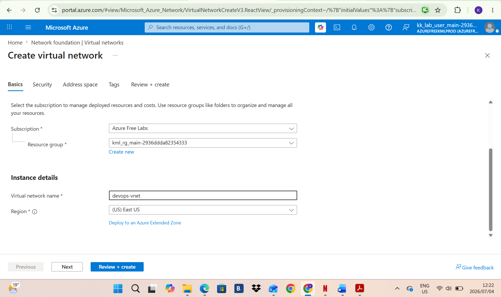
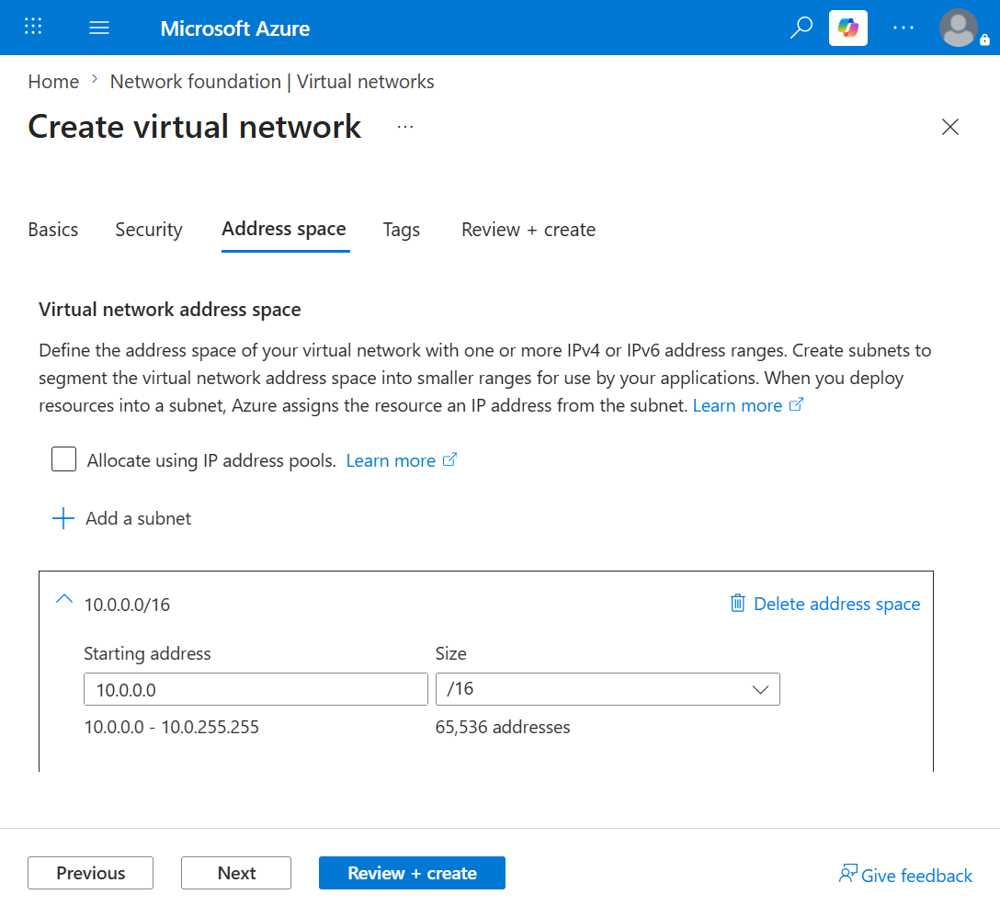
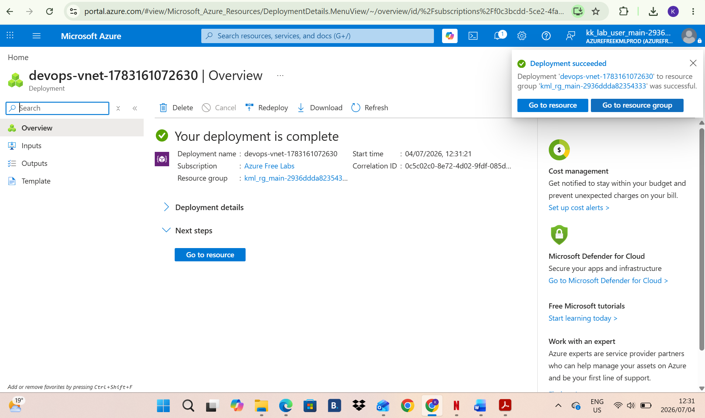

# Day 4: Project Overview

Today I was tasked with creating a virtual network named devops-vnet in the eastus region with any IPv4 CIDR block.

## Key Learnings
* Learned how to create a Vnet and understood that they provide isolated network boundaries for resources in Azure.
* I configured custom IPv4 CIDR blocks to define the private IP address space.

## Screenshots
### 1. Task Instructions and Scenario
Here is the initial Project prompt otlining the requirements for building a vnet

