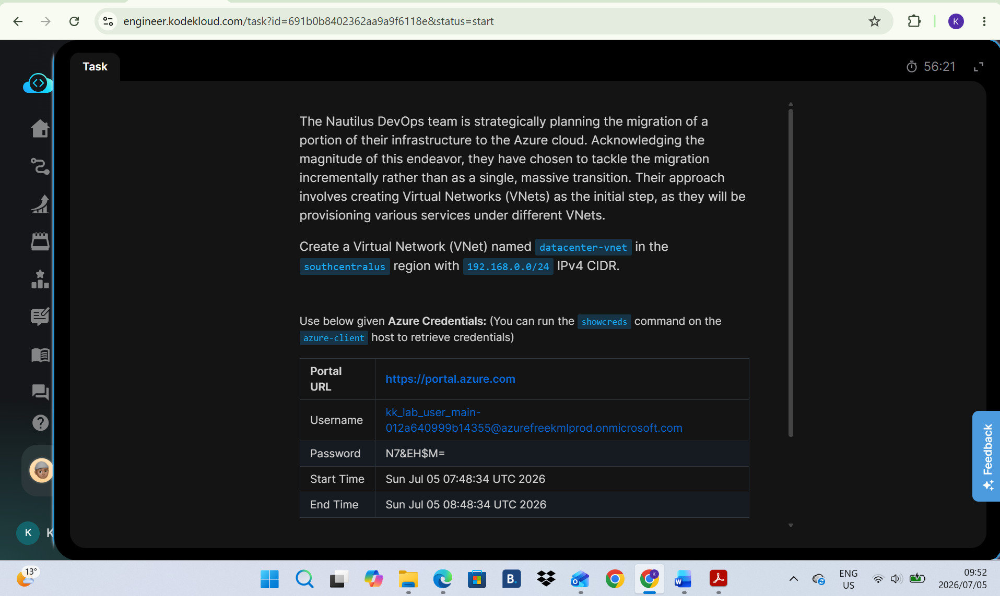
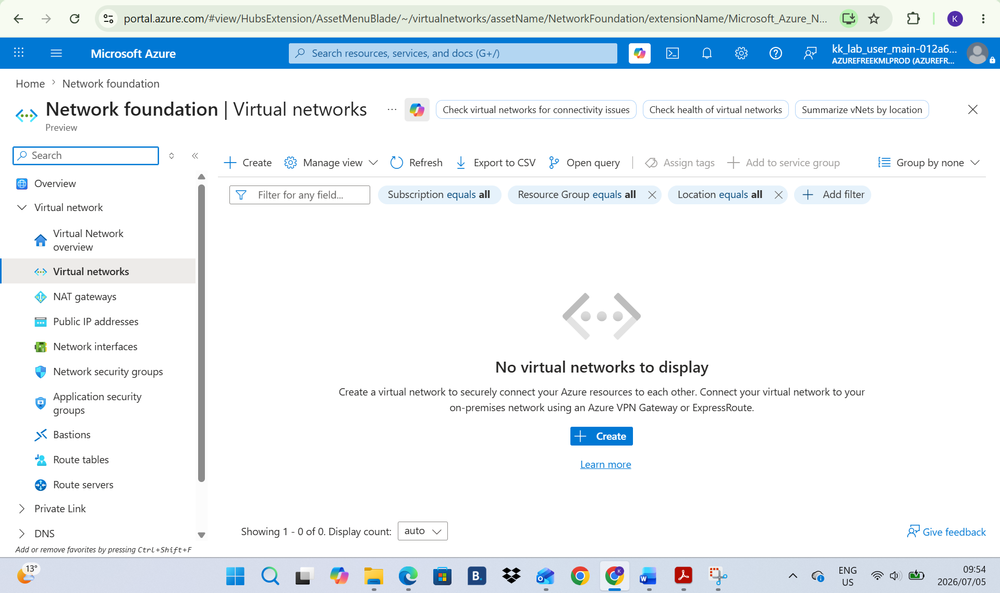
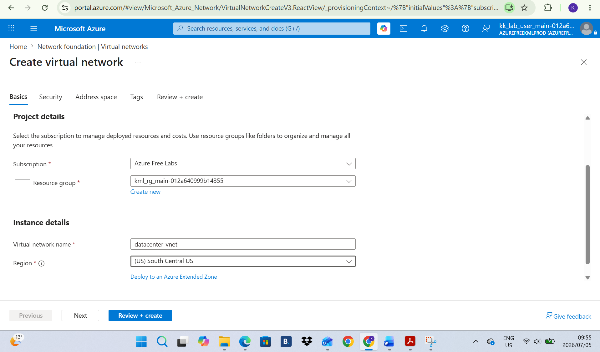
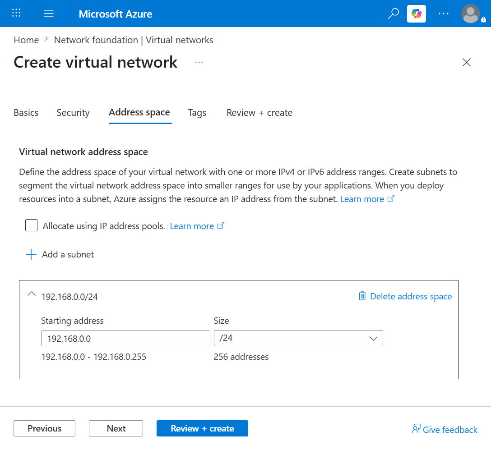
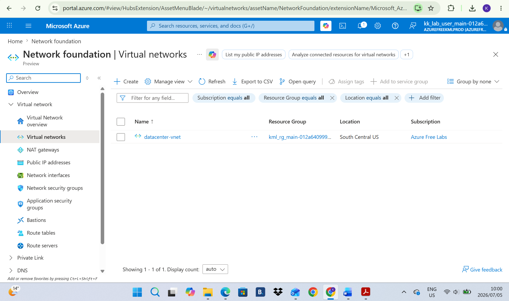
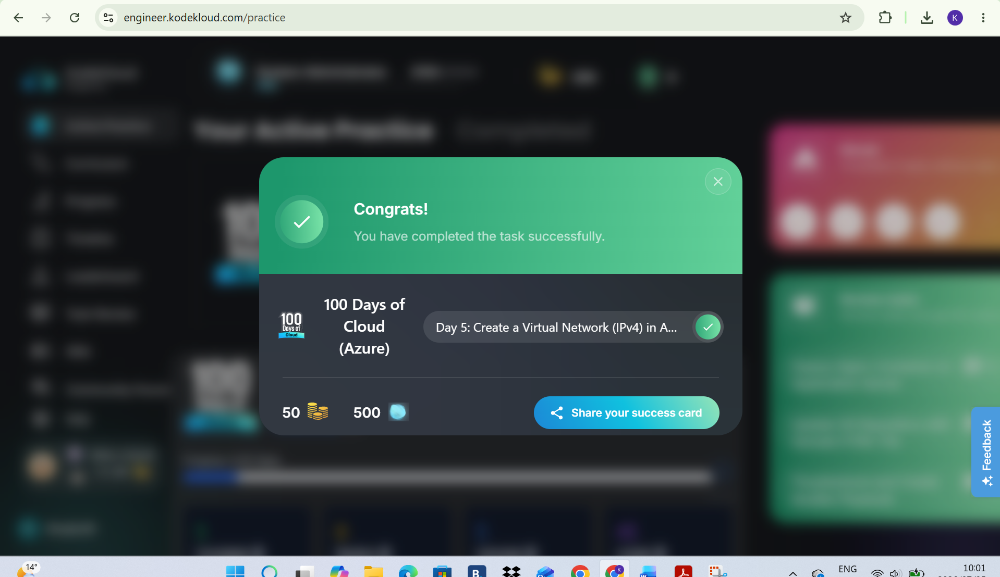

# Day 5: Project Overview

Today I was tasked with creating a Virtual Network named datacenter-vnet in the southcentral region with 192.168.0.0/24 IPv4 CIDR

## Key Learnings
* Learned how to create a Vnet and understood that they provide isolated network boundaries for resources in Azure.
* I configured custom IPv4 CIDR blocks to define the private IP address space.
* Gained experience with ceating a Vnet in a specific region

## Screenshots

