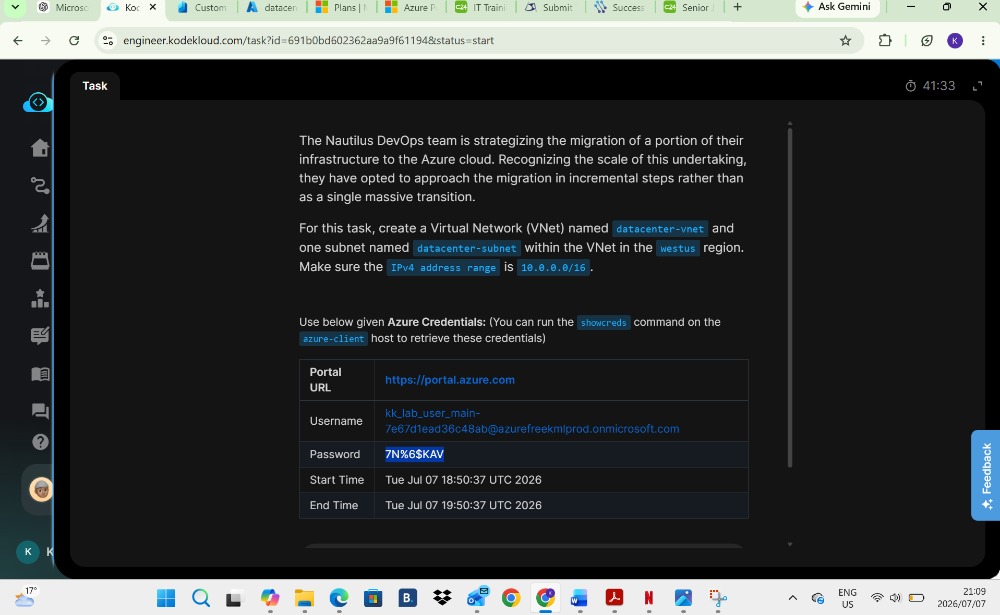
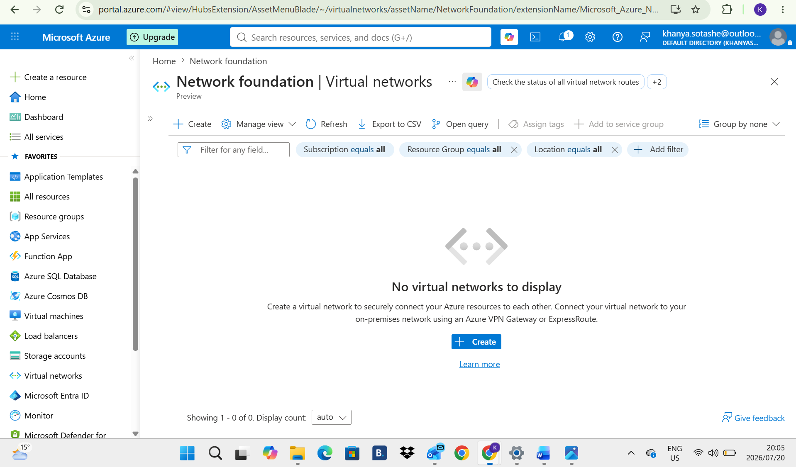
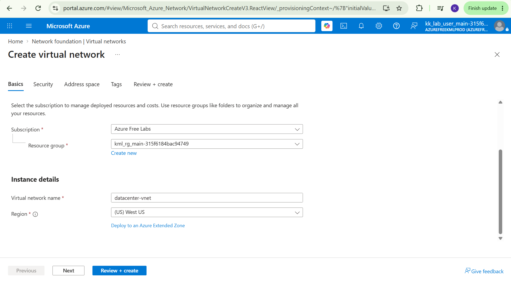
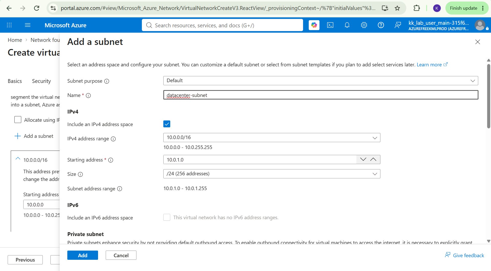
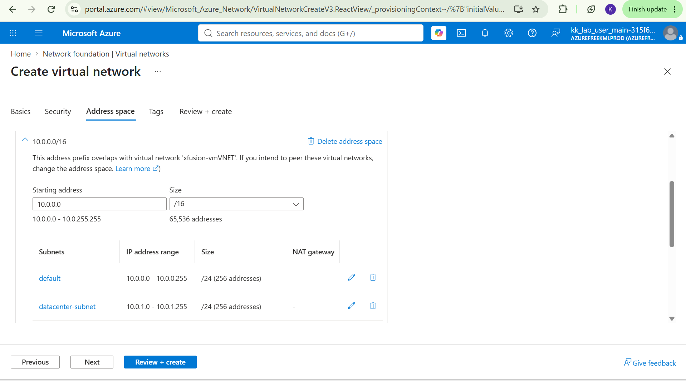
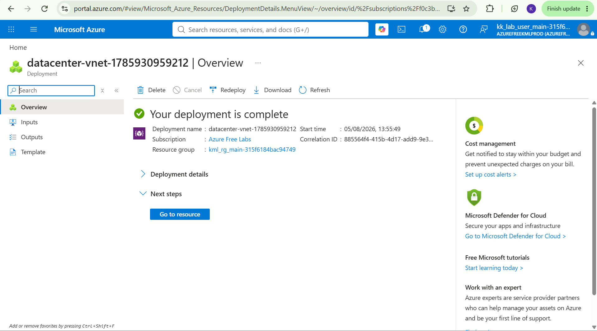

# Day 6: Project Overview

Today I was tasked with creating a Virtual Network named datacenter-vnet in the west-us region with one subnet within the Vnet in a specified IPv4 address range.

## Key Learnings
* Successfully created and configured a Virtual Network (`datacenter-vnet`) to define a secure, private IP boundary for cloud resources.
* Segmented the VNet by designing a logical subdivision (`datacenter-subnet`) where Azure resources, like Virtual Machines, can be securely deployed.
* Gained hands-on experience assigning a foundational IPv4 address space (10.0.0.0/16), allowing for scalable subnetting and future workload expansion.
* Learned how subnet design is essential for separating application tiers, controlling routing, and applying targeted security rules.

## Screenshots
### 1. Task Instructions and Scenario
Here is the initial project prompt outlining the requirements for building 'Datacenter-vnet'

### 2. Toggle to Virtual Network
This is where we toggle to Virtual Network to find that there has not been a Vnet created.

### 3. Create Virtual Network name and region
This is where we create the Virtual Network Name and in the westus region.

### 3. Create Subnet name and address region
This is where we create the Subnet Name and make sure the IPv4 address is in the 10.0.0.0/16 region.

### 3. Subnet created
This is the confirmation that the Subnet was created.

### 3. Deployment Confirmed
Deployment is confirmed.

