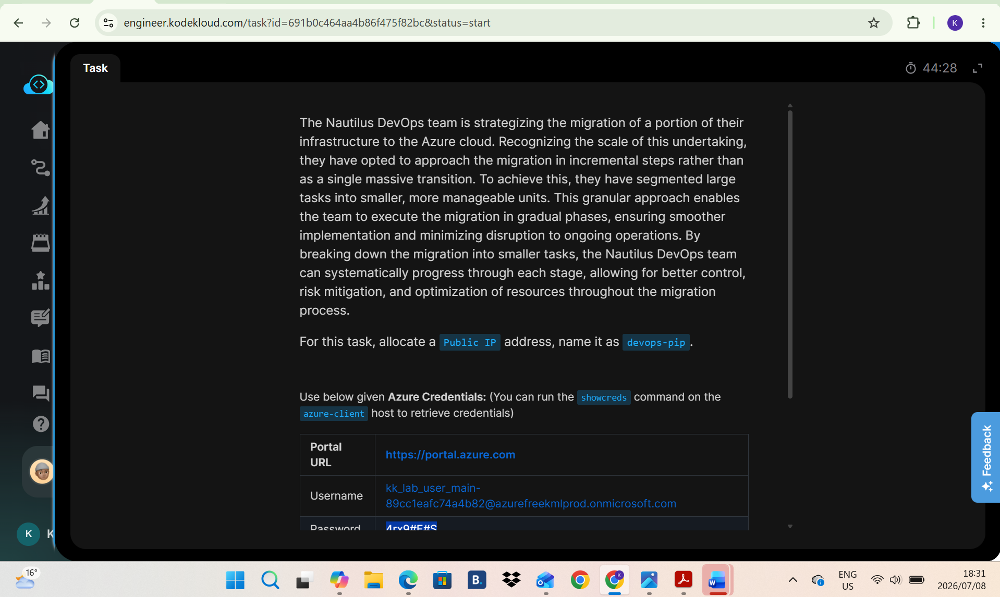
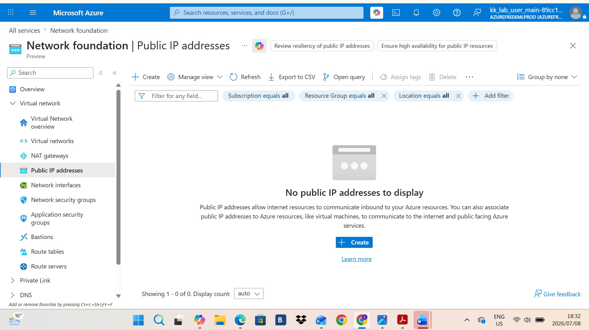
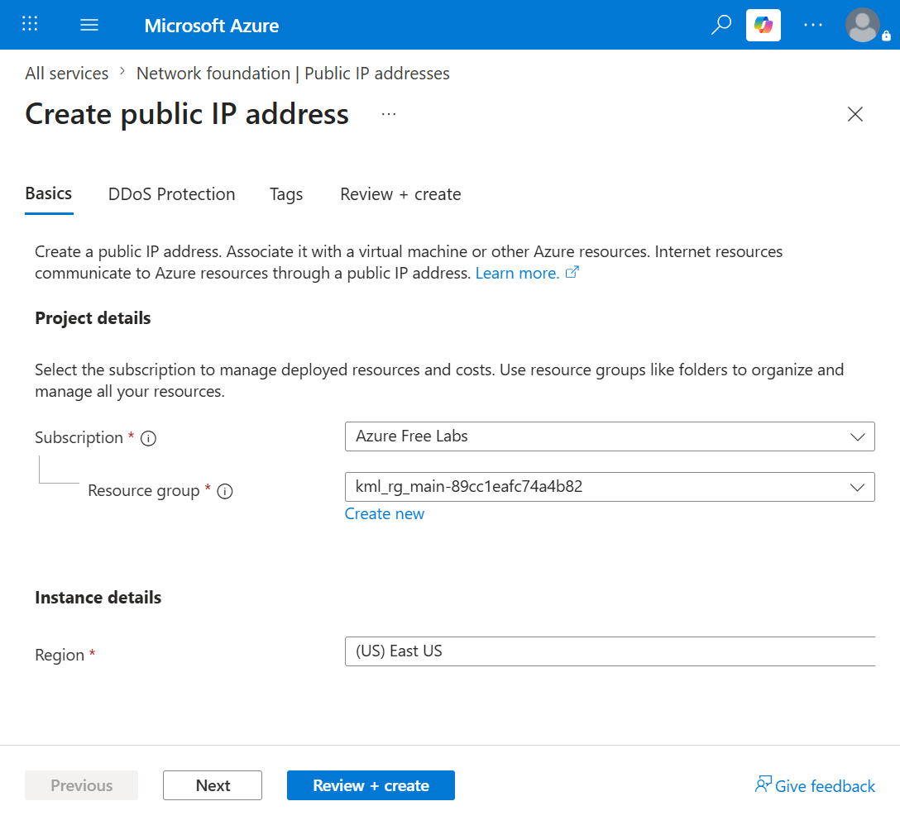
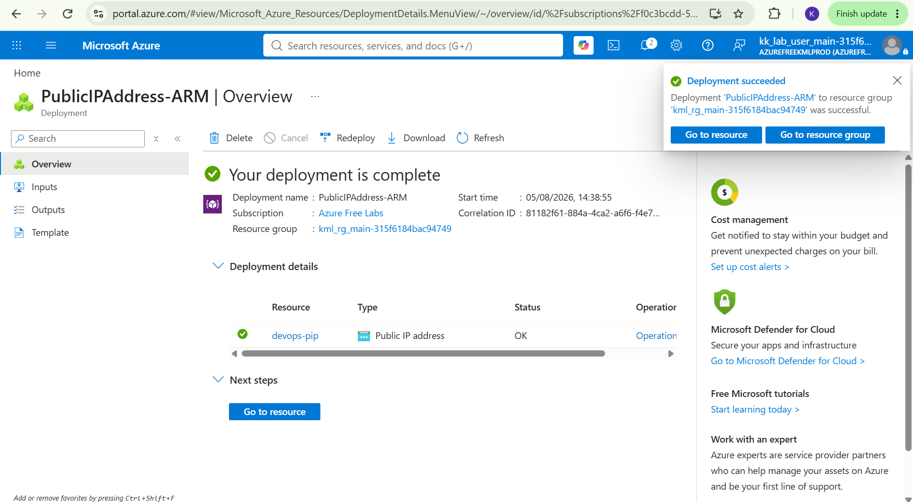

# Day 7: Project Overview

Today I was tasked with allocating a public IP address and naming it devops-pip.

## Key Learnings
* Public IP Provisioning: Successfully completed the hands-on challenge of creating a Public IP address for a Virtual Machine in Azure.
* Cloud Connectivity: Gained practical experience managing external access by associating the new Public IP directly to the Azure VM instance.
  

## Screenshots
### 1. Task Instructions and Scenario
Here is the initial project prompt outlining the requirements for creating Public IP

### 2. Toggle to Public IP
This is where we toggle to the Public IP region to find that there has not been a IP created.

### 3. Create Public IP
This is where we create the Public IP and name it Devops-pip.

### 3. Deploy IP
Confirmation that the IP is created.

