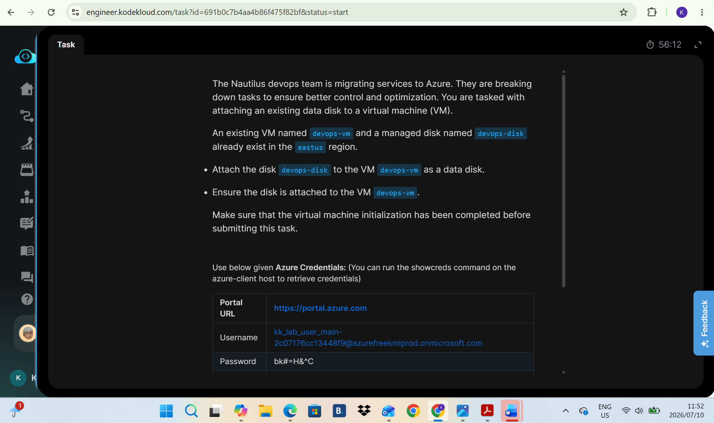
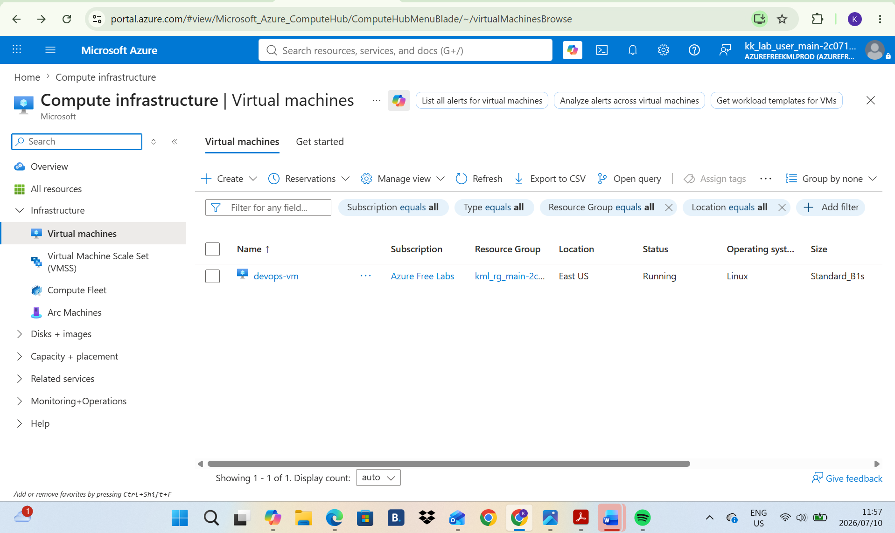
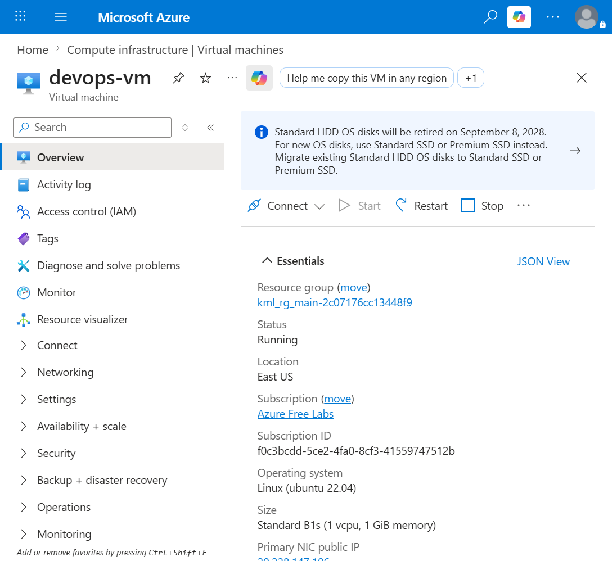
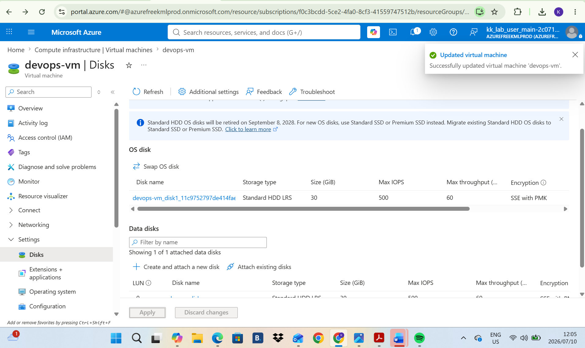

# Day 8: Project Overview

Today I was tasked with attaching an existing disk to an existing Virtual Machine

## Key Learnings
* **Storage Management:** Successfully attached an existing Azure Managed Disk to a Virtual Machine dynamically, simulating a real-world scenario where storage requirements change after deployment.
* **Block-Level Storage:** Gained hands-on understanding of Managed Disks as independent, block-level storage resources where the underlying infrastructure is handled by Microsoft.
* **Data Disk vs. OS Disk:** Practically applied the concept of separating the operating system from application data by attaching an external data disk that can persist independently of the VM lifecycle.

## Why Wait for VM Initialization?
When modifying virtual machines, you must ensure the initialization is fully complete before attaching or validating disks. The VM needs to be fully provisioned and sitting in a "running" or "stopped" state, rather than a "creating" or "updating" state.
### Here is why this is important:
1. Resource Locking in Azure: When a VM is still initializing, the Azure resource provider places a lock on it to prevent conflicting changes. Attempting to attach a disk while the fabric is still building the VM will usually result in a failed deployment error.
2. Guest OS Hardware Detection: The virtual machine's operating system needs to be completely booted to load its storage drivers. If you attach a disk before the OS is ready to listen for hardware changes, the disk may not mount correctly, or you won't be able to initialize and format it inside the OS.
3. Validation Scripts: For lab environments like KodeKloud, the automated grading scripts query the VM's state through the Azure API. If the VM is still reporting as "updating" or "creating," the script might skip the disk check entirely and mark the task as incomplete.
  

## Screenshots
### 1. Task Instructions and Scenario
Here is the initial project prompt outlining the requirements for creating Public IP

### 2. Toggle to Public IP
This is where we toggle to the Public IP region to find that there has not been a IP created.

### 3. Create Public IP
This is where we create the Public IP and name it Devops-pip.

### 4. Deploy IP
Confirmation that the IP is created.

